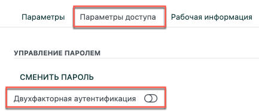
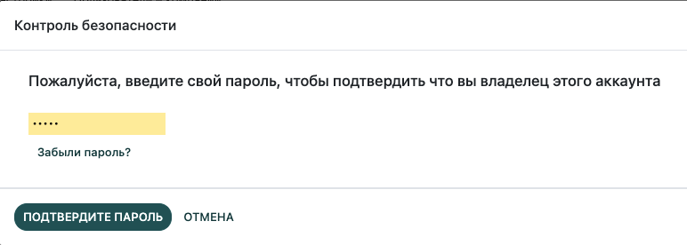

============================
Двухфакторная аутентификация
============================

Двухфакторная аутентификация (2FA) - это хороший способ повысить
безопасность учетной записи от несанкционированного проникновения мошенников.

На практике это выглядит так: при входе в систему, помимо пароля, необходимо предоставить
секретный одноразовый код, который автоматически отображается в  *аутентификаторе*
(обычно это ваш мобильный телефон).

Таким образом, злоумышленнику необходимо не только подобрать
пароль, но и получить доступ к вашему устройству, что значительно
усложняет задачу.

Требования
==========

.. note:: Ниже перечислены примеры ПО для двухфакторной аутентификации. Эта информация носит исключительно рекомендательный характер.

Аутентификация с помощью телефона - самый простой и
распространенный метод, поэтому предположим, что вы выбрали именно его. Примеры программ для 2FA:

`Authy <https://authy.com/>`_, `FreeOTP
<https://freeotp.github.io/>`_, `Google Authenticator
<https://support.google.com/accounts/answer/1066447?hl=en>`_,
`LastPass Authenticator <https://lastpass.com/auth/>`_, `Microsoft
Authenticator
<https://www.microsoft.com/en-gb/account/authenticator?cmp=h66ftb_42hbak>`_,
...; пароль администратора также обычно поддерживает :abbr:`2FA (двухфакторную аутентификацию)`, например: `1Password
<https://support.1password.com/one-time-passwords/>`_, `Bitwarden
<https://bitwarden.com/help/article/authenticator-keys/>`_, ...

В качестве демонстрации будем использовать Google Authenticator
(так как это одно из наиболее популярных приложений друхфакторной аутентификации).

Установка двухфакторной аутентификации
======================================

После того, как вы определились с выбором ПО для двухфакторной аутентификации,
необходимо активировать ее в системе. Для этого войдите в ваш аккаунт системы **Модули**
и откройте
:guilabel:`Мои данные`.
Затем откройте вкладку :guilabel:`Параметры доступа` и активизируйте поле
:guilabel:`Двухфакторная аутентификация`.

Так как это действие требует право доступа, вам необходимо будет ввести
свой пароль.

После этого появится экран со штрихкодом. В большинстве приложений вы можете просто *отсканировать штрихкод* и программа
выполнит все настройки автоматически.

.. note::

   Если вы не можете сделать скриншон (например, вы работаете на одном мобильном устройстве), то вы можете
   перейти по ссылке или скопировать код для ручной настройки.

После этого, приложение аутентификации должно сгенерировать *проверочный код* и некоторую идентификационную информацию (например, домен и
логин, для которого предназначен код).

Введите этот код в поле :guilabel:`Код проверки`
в системе **Модули** и нажмите на кнопку :guilabel:`Двухфакторная аутентификация`.

Поздравляем, теперь ваша учетная запись надежно защищена!

Вход в систему
==============

Вам необходимо :guilabel:`Выйти` из системы, чтобы при повторном входе использовать настройки аутентификации.

На странице входа в систему введите имя пользователя и пароль учетной записи, для
которой вы настроили :abbr:`2FA (двухфакторную аутентификацию)`.

После успешного входа в учетную запись вам нужно открыть
приложение и ввести код, который сгенерировало приложение.

Вот и все. С этого момента, пока вы не отключите двухфакторную
аутентификацию, вы всегда будете использовать двухэтапный процесс входа в систему.

.. danger::  Чтобы отключить функцию двухфакторной аутентификации в своем аккаунте, вам потребуется помощь
            *Администратора*, поэтому старайтесь не потерять данные для входа в систему.
