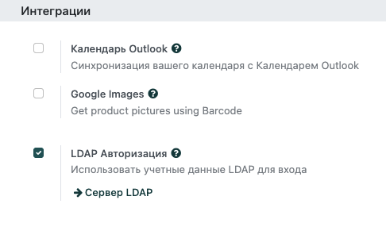
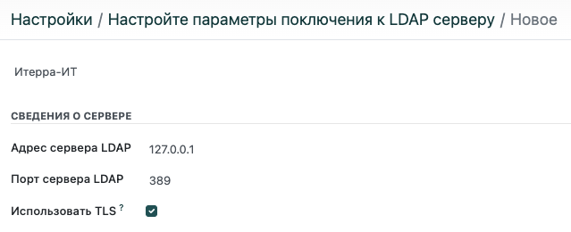
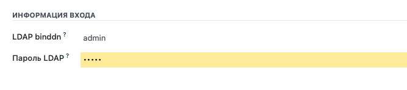
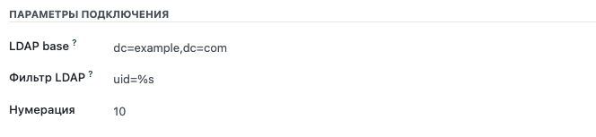

=============================
Вход в систему с помощью LDAP
=============================

- В меню **Общие настройки > Интеграции**, поставьте галочку в строке **LDAP Авторизация**. Сохраните, чтобы активизировать эту функцию.

- Кликните на активную ссылку *Сервер LDAP* и в открывшихся настройках нажмите кнопку **Создать**.

- Выберите компанию, которая будет использовать LDAP-протокол.

- В **Сведениях о сервере** введите IP-адрес вашего сервера и порт.

- Установите галочку в строке **Использовать TLS**, если ваш сервер совместим c протоколом TLS.

- В разделе **Информация входа** укажите ID и пароль учетной записи, используемый при запросах к серверу. Если оставить этот раздел пустым, запросы к серверу будут выполняться анонимно.

- В **Параметрах подключения > LDAP-база** укажите имя домена LDAP-сервера, иcпользуя терминологию LDAP (например, ``dc=example,dc=com``).

- В поле **Фильтр LDAP** введите ``uid=%s``.

- В **Сведениях о пользователе** отметьте *Создайте пользователя*, если вы хотите, чтобы был создан профиль пользователя при первом входе в систему с помощью LDAP.

- В поле **Шаблон пользователя** укажите шаблон для новых профилей. Если оставить это поле пустым, в качестве шаблона будет использоваться профиль администратора.

