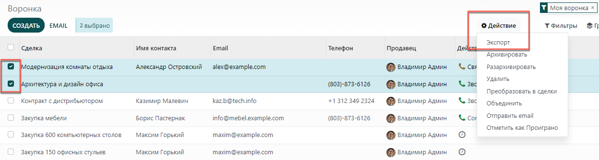

=======================
Экспорт и импорт данных
=======================

.. _export-data:

Экспорт данных из системы Модули
================================

При работе с базой данных иногда возникает необходимость экспортировать данные в отдельный файл.
Это может помочь упростить отчетность вашей организации (учитывая тот факт, что в каждом модуле уже есть точный и простой инструмент для создания отчетов).

С помощью системы **Модули** вы можете экспортировать любые данные.
Для этого, выберите нужный элемент из списка, чтобы кнопка **Действие** стала активной. Из выпадающего меню **Действие**,
нажмите **Экспорт**.

Это действие довольно простое, но все же есть некоторые особенности. При нажатии на **Экспорт** появляется всплывающее окно с несколькими
вариантами экспортируемых данных:

#. При выбранной опции *Я собираюсь потом загружать данные* система
   показывает только те поля, которые могут быть импортированы. Это очень полезная функция
   если вы хотите обновить существующие записи. Она работает
   в качестве фильтра. Если оставить флажок не отмеченным, то будет доступно гораздо больше вариантов, так как отображаются все поля, а не только те, которые
   могут быть импортированы.
#. При экспорте вы можете выбрать один из двух форматов: .csv и .xls.
   В формате .csv элементы разделяются запятой, а формат .xls содержит информацию обо всех
   изменениях в файле, включая содержимое и форматирование.
#. Используйте стрелки для отображения
   дополнительных опций подполей. Вы также можете использовать строку поиска, чтобы
   облегчить поиск конкретных полей. Чтобы сделать процесс поиска еще
   эффективнее, отобразите все поля, нажав на все
   стрелки!
#. Кнопка + служит для добавления полей в список *Поля для экспорта*.
#. "Ручки" рядом с выбранными полями позволяют перемещать поля вверх и вниз, чтобы
   изменить порядок, в котором они будут отображаться в экспортируемом
   файле.
#. Используйте корзину, чтобы удалить ненужное поле.
#. Для повторяющихся отчетов полезна функция сохранения настроек экспорта.
   Чтобы сохранить настройки экспорта, выберите необходимые данные и в поле *Шаблон* выберите *Новый шаблон*.
   Назовите шаблон для экспорта. В следующий раз, когда вам понадобится экспортировать тот же список полей, просто выберите
   соответствующий шаблон.

.. tip::
   Полезно знать внешний идентификатор поля. Например,
   *Связанная компания* - это *parent_id*. Это поможет экспортировать
   только те данные, которые вы будете импортировать в дальнейшем. Для того, чтобы отобразть ID поля, включите
   режим разработчика.

.. _import-data:

Импорт данных в систему Модули
==============================

Как начать
----------

Вы можете импортировать любые данные, используя Excel
(.xlsx) или CSV (.csv) форматы:
контакты, продукты, банковские выписки, записи в журнале и даже заказы!

Откройте страницу просмотра объекта, который вы хотите импортировать, и нажмите на :menuselection:`Избранное --> Импортировать
записи`.

Представленные шаблоны можно легко заменить собственными данными. Такие шаблоны можно импортировать в один клик, т.к.
сопоставление данных уже выполнено.

Как адаптировать шаблон
-----------------------

* Добавляйте, удаляйте и сортируйте столбцы, чтобы они наилучшим образом соответствовали вашей структуре данных.
* Мы советуем не удалять **ID** (см. объяснение в следующем разделе).
* Создайте уникальный ID для каждой записи, перетаскивая вниз последовательность ID.

.. image:: export_import_data/dragdown.gif
   :align: center

* Когда вы добавляете новую колонку, система может не определить ее автоматически, если
  название не соответствует какому-либо полю. Не волнуйтесь! Вы можете сопоставить
  новые колонки вручную при тестировании импорта. Для этого найдите в списке
  соответствующее поле.

    .. image:: export_import_data/field_list.png
       :align: center

  Выберите название этого поля в своем файле, чтобы оно было использовано корректно при
  следующем импорте.

Как импортировать данные из другого приложения
----------------------------------------------

Для того, чтобы создать связь между различными данными,
необходимо использовать уникальный идентификатор из исходного приложения
и сопоставить его со столбцом **ID** (внешний идентификатор) в системе **Модули**.
Когда вы импортируете другую запись, которая связана с первой,
используйте **XXX/ID** (XXX/Внешний ID) для исходного уникального идентификатора.
Вы также можете найти запись по ее названию, но могут возникнуть трудности,
если хотя бы 2 записи имеют одинаковое название.

**ID** также будет использоваться для обновления исходного импорта,
если позже вам понадобится повторно импортировать измененные данные.
Поэтому рекомендуется указывать **ID** всегда, когда это возможно.

Я не могу найти поле, к которому хочу привязать столбец
-------------------------------------------------------

Используя первые десять строк вашего файла, система **Модули** пытается определить тип поля для каждого столбца.
Например, если у вас есть колонка, содержащая только числа, на выбор будут представлены
поля типа *Цифры*.
Хотя эта функция проста и удобна в большинстве случаев,
есть вероятность, что что-то пойдет не так или по умолчанию не будет представлено нужного столбца с полем.

Если это произойдет, вам просто нужно выбрать опцию
** Show fields of relation fields (advanced)**,
после чего вы сможете выбрать из полного списка полей для каждого столбца.

Где я могу изменить формат импорта даты?
----------------------------------------

Система автоматически определяет, является ли столбец датой, и угадывает формат даты из
набора наиболее часто используемых форматов дат. Хотя этот процесс работает со многими форматами,
некоторые форматы дат не могут быть распознаны.
Это может привести к путанице из-за инверсии дня и месяца; трудно определить,
какая часть формата даты является днем, а какая - месяцем в такой дате, как
например, "01-03-2016".

Чтобы посмотреть, какой формат даты система распознала в вашем файле, выберите **Формат даты**, при нажатии на **Опции** под выбором файлов.
Если этот формат неверен, вы можете
изменить его, используя *ISO 8601* для определения формата.

.. note::
   Если вы импортируете файл excel (.xls, .xlsx), вы можете использовать специальный формат ячейки для дат. Так вы будете уверены,
   что формат даты будет правильно отображаться в системе.

Могу ли я импортировать числа со знаком валюты (например: $32.00)?
------------------------------------------------------------------

Да, мы полностью поддерживаем числа со скобками для обозначения отрицательного знака, а также числа со
знаком валюты. Система **Модули** также автоматически определяет, какой тысячный/десятичный разделитель вы используете
(вы можете изменить их в разделе **опции**). Если вы используете символ валюты, который не известен
системе, он может быть не распознан как число и произойдет сбой.

Примеры поддерживаемых чисел (на примере тридцати двух тысяч):

- 32.000,00
- 32000,00
- 32,000.00
- -32000.00
- (32000.00)
- $ 32.000,00
- (32000.00 €)

Пример, который не будет работать:

- ABC 32.000,00
- $ (32.000,00)

Что делать, если таблица предварительного просмотра импорта отображается некорректно?
-------------------------------------------------------------------------------------

По умолчанию предварительный просмотр импорта использует запятые как разделители полей и кавычки как разделители текста.
Если ваш файл csv не имеет таких настроек, вы можете изменить параметры формата файла
(отображаются под строкой Обзор файла CSV после выбора файла).

Обратите внимание, что если ваш CSV файл имеет табуляцию в качестве разделителя, система не обнаружит разделения. Вам
необходимо изменить параметры формата файла в программе для работы с электронными таблицами. Смотрите следующий
вопрос.

Как изменить параметры формата CSV при сохранении в приложении для работы с электронными таблицами?
---------------------------------------------------------------------------------------------------

Если вы редактируете и сохраняете файлы CSV в приложениях для работы с электронными таблицами, будут применяться региональные настройки вашего компьютера.
Мы рекомендуем использовать OpenOffice или LibreOffice Calc, поскольку
эти программы позволят изменить все три параметра (в меню: :menuselection:`'Сохранить как' --> выберите 'Edit filter settings' --> Сохранить`).

Microsoft Excel позволяет изменить только кодировку при сохранении (в меню: :menuselection:`'Сохранить как'
 -->  'Сервис' -->  'Кодировка').

В чем разница между ID базы данных и внешним ID?
------------------------------------------------

Некоторые поля определяют связь с другим объектом. Например, страна контакта связана с данными объекта 'Страна'. Когда вы хотите импортировать такие поля, системе придется
воссоздать связи между различными данными. Для импорта таких полей, предоставлены три
механизма. Вы можете использовать только один механизм для каждого поля, которое вы хотите импортировать.

Например, для ссылки на страну контакта, система предлагает импортировать 3 различных поля:

- Страна: название или код страны
- Идентификатор страны/базы данных: уникальный идентификатор для записи, определяемый столбцом ID postgresql
- Страна/Внешний ID: ID этой записи, на которую ссылается другое приложение (или файл .XML, который ее импортировал).

Для страны Бельгия вы можете использовать один из этих 3 способов импорта:

- Страна: Бельгия
- Идентификатор страны/базы данных: 21
- Страна/Внешний идентификатор: base.be

В зависимости от задачи, вы можете использовать один из этих 3 способов:

- Использовать страну: Это самый простой способ, если данные из CSV-файлов, которые были созданы
  вручную.
- Использовать идентификатор страны/базы данных: Этот способ используется редко разработчиками, т.к.
  его главное преимущество - это отсутствие ошибок (у вас может быть несколько записей с одинаковым именем,
  но они всегда имеют уникальный идентификатор базы данных)
- Использовать страну/внешний ID: Используйте внешний ID, когда вы импортируете данные из стороннего приложения.

При использовании внешних идентификаторов вы можете импортировать файлы CSV с колонкой "Внешний идентификатор", чтобы определить
внешний ID каждой импортируемой записи. Затем вы сможете соотнести эту запись
с помощью столбцов типа "Поле/Внешний идентификатор".

Что можно сделать, если имеется несколько совпадающих полей?
------------------------------------------------------------

Если, например, у вас есть две категории товаров с дочерним названием "Продаваемые", проверка будет остановлена, но вы все равно сможете импортировать данные.
Однако мы рекомендуем не импортировать данные, потому что все они будут связаны с
первой категории "Продаваемые". В таком случае, рекомендуется изменить одно из значений дубликатов или иерархию категорий продуктов.

Если вы не хотите изменять конфигурацию категорий продуктов, мы рекомендуем использовать
внешний идентификатор для этого поля 'Категория'.

Как импортировать поля с тегами?
--------------------------------

Теги должны быть разделены запятой без пробелов. Например, если вы хотите, чтобы ваш клиент
был связан с тегами 'Производитель' и 'Розничный продавец', то теги должны выглядеть следующим образом: "Производитель,Розничный продавец" в одном столбце вашего CSV-файла.

Как импортировать несколько строк заказа?
-----------------------------------------

Если вы хотите импортировать заказ, имеющий несколько строк; для каждой строки заказа вам необходимо
зарезервировать определенную строку в CSV-файле. Первая строка заказа будет импортирована в ту же строку, что и
информация, относящаяся к заказу. Для любых дополнительных строк потребуется дополнительная строка, не содержащая
никакой информации в полях, относящихся к заказу.

Можно ли импортировать несколько раз одни и те же данные?
---------------------------------------------------------

Если вы импортируете файл, который содержит одну из колонок: "Внешний ID" или "ID базы данных", данные, которые
уже были импортированы, будут изменены, а не вновь созданы. Это очень полезная функция, так как
позволяет несколько раз импортировать один и тот же CSV-файл, только внося необходимые изменения. Система **Модули** автоматически создаст или изменит каждую запись в зависимости от того, новая она или нет.

Эта функция позволяет использовать инструмент импорта/экспорта для изменения большого количества данных в вашей любимой программе для работы с электронными таблицами.

Что произойдет, если я не укажу значение для определенного поля?
----------------------------------------------------------------

Если вы не настроите все поля в вашем CSV файле, система **Модули** присвоит значение по умолчанию для каждого неопределенного поля. Если вы зададите поля с пустыми значениями в CSV-файле, система установит значение EMPTY
в поле, вместо того чтобы присвоить значение по умолчанию.

Как экспортировать/импортировать различные таблицы из SQL приложения в систему Модули?
--------------------------------------------------------------------------------------

Если вам нужно импортировать данные из разных таблиц, вам придется создать связь между
данными, принадлежащими к разным таблицам. (Например, если вы импортируете компании и людей, вам придется
создать связь между каждым человеком и компанией, в которой он работает).

Для управления связями между таблицами вы можете использовать возможности системы **Модули** "Внешний идентификатор".
Внешний ID данных - это уникальный идентификатор этих данных в другой программе. "Внешний ID"
должен быть уникальным для всех объектов, поэтому используется префикс
и название программы или таблицы (например, 'company_1', 'person_1' вместо
'1').

В качестве примера предположим, что у вас есть база данных SQL с двумя таблицами, которые вы хотите импортировать: компании и
персонал. Каждый человек принадлежит к одной компании, поэтому вам придется создать связь между человеком
и компанией, в которой он работает.

Сначала мы экспортируем все компании и их "Внешний идентификатор". В PSQL введите следующую команду:

.. code-block:: sh

   > copy (select 'company_'||id as "External ID",company_name as "Name",'True' as "Is a Company" from companies) TO '/tmp/company.csv' with CSV HEADER;

Эта команда SQL создаст следующий файл CSV:

.. code-block:: text

   External ID,Name,Is a Company
   company_1,Bigees,True
   company_2,Organi,True
   company_3,Boum,True

Для создания CSV-файла для лиц, связанных с компаниями, воспользуемся следующей SQL-командой в PSQL:

.. code-block:: sh

    > copy (select 'person_'||id as "External ID",person_name as "Name",'False' as "Is a Company",'company_'||company_id as "Related Company/External ID" from persons) TO '/tmp/person.csv' with CSV

В результате получится следующий CSV-файл:

.. code-block:: text

   External ID,Name,Is a Company,Related Company/External ID
   person_1,Fabien,False,company_1
   person_2,Laurence,False,company_1
   person_3,Eric,False,company_2
   person_4,Ramsy,False,company_3

Как видно из этого файла, Fabien и Laurence работают на компанию Bigees (company_1), а
Eric работает в компании Organi. Связь между людьми и компаниями осуществляется с помощью
Внешнего идентификатора компаний. Нам пришлось добавить префикс "External ID" к названию таблицы, чтобы избежать
ошибки ID между людьми и компаниями (person_1 и company_1, которые имели одинаковый ID 1 в
оригинальной базе данных).

Два созданных файла готовы к импорту в систему **Модули** без каких-либо изменений. После
импорта этих двух CSV файлов, у вас будет 4 контакта и 3 компании (первые два контакта
связаны с первой компанией). Необходимо сначала импортировать компании, потом людей.

Как адаптировать шаблон импорта
===============================

Шаблоны импорта предоставляются в инструменте импорта наиболее распространенных данных для
импорта (контакты, продукты, банковские выписки и т.д.).
Вы можете открыть их с помощью любой программы для работы с электронными таблицами (Microsoft Office,
OpenOffice, Google Drive и т.д.).

Как настроить файл
==================

* Удалите ненужные столбцы. Мы советуем не удалять *ID* (см.
  объяснение ниже).
* Установите уникальный ID для каждой записи, перетаскивая вниз последовательность ID.

  .. image:: export_import_data/dragdown.gif
     :align: center

* Когда вы добавляете новый столбец, система может не сопоставить его автоматически, если его
  название не соответствует какому-либо полю системы.
  В этом случае найдите соответствующее поле, используя поиск.

  Затем используйте это название в шаблоне импорта, чтобы он работал
  сразу же при следующей попытке импорта.

Зачем нужен столбец "ID"
========================

**ID** (внешний идентификатор) - это уникальный идентификатор для линейного элемента.
Не бойтесь использовать идентификатор из вашего предыдущего программного обеспечения, чтобы упростить переход на систему
**Модули**.

Установка ID не является обязательной при импорте, но она помогает во многих случаях:

* Обновление импорта: вы можете импортировать один и тот же файл несколько раз, не создавая дубликатов;
* Импорт связанных полей (см. ниже).

Как импортировать связанные поля
================================

Объект системы **Модули** всегда связан со многими другими объектами (например, продукт связан
с категориями товаров, атрибутами, поставщиками и т.д.). Чтобы импортировать эти связи, вам необходимо
сначала импортировать данные связанного объекта, используя меню объекта.

Это можно сделать с помощью названия связанной записи или ее ID. Идентификатор необходим, если
две записи имеют одинаковое название. В этом случае добавьте " / ID" в конце названия столбца
(например, для атрибутов продукта: Атрибуты продукта / Атрибут / ID).