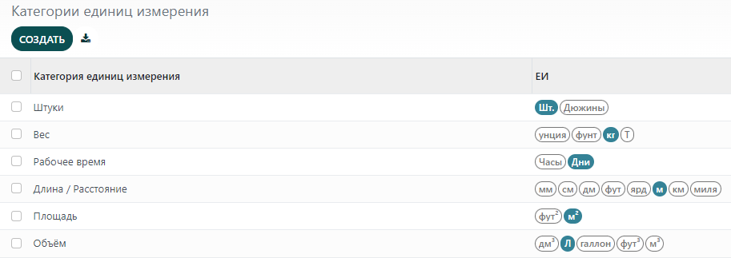

=====================================
Использование разных единиц измерения
=====================================

В некоторых случаях необходимо работать с продуктами в разных единицах измерения.
Например, если вы покупаете товары в стране, где применяется
метрическая система, а продаете в стране, где используется имперская система,
вам необходимо конвертировать единицы измерения.
Еще один распространенный случай использования разных единиц измерения
- это закупка продуктов в больших упаковках у поставщика и расфасовка товара на продажу.

Вы можете настроить систему таким образом, чтобы один продукт имел разные единицы измерения.

Настройки
=========

В приложении *Склад* перейдите в меню: :menuselection:`Настройки --> Настройки`. В
разделе *Продукты*, поставьте галочку в поле *Единицы измерения* и нажмите *Сохранить*.

Создание новых единиц измерения
===============================

В приложении *Склад* перейдите в меню :menuselection:`Настройки --> Единицы измерения товара`.
Нажмите *Сохранить*.

Поле *Категория единиц измерения* необходимо для преобразования единиц измерения. Вы сможете
перевести продукты из одной единицы измерения в другую только в том случае,
если эти единицы принадлежат к одной и той же категории.

Каждая категория единиц измерения имеет основную единицу измерения. Она выделена синим цветом в
столбце :guilabel:`Uom` на странице :guilabel:`Категории единиц измерения`. Система использует
основную единицу в качестве базовой для всех новых единиц измерения.

Чтобы создать новую единицу измерения, сначала выберите правильную категорию.
Например, чтобы продать продукт в коробке из
шести штук, нажмите на строку :guilabel:`Штуки`. Далее,
нажмите :guilabel:`добавить строку`. В столбце :guilabel:`Единица измерения`, введите новую
единицу измерения
`Коробка из 6`. В столбце :guilabel:`Раздел`, выберите :guilabel:`Больше, чем базовая единица
измерения`. В столбце :guilabel:`Коэффициент`, введите `6.00000`, так как коробка из 6 штук
в 6 раз больше базовой единицы измерения (`1.00000`).

Указывайте единицы измерения на ваших продуктах
===============================================

В меню: :menuselection:`Продукты --> Продукты`, откройте продукт,
в котором вы хотите изменить единицы измерения.

На вкладке **Общая информация**, в поле **Единица измерения**, выберите
единицу измерения в которой продукт
будет продаваться и будут осуществляться внутренние перемещения.
Вы также можете выбрать единицу измерения для закупки товара.

Перевод из одной единицы измерения в другую
===========================================

Покупка по закупочной единице измерения
---------------------------------------

В приложении **Закупки** создайте новый заказ на поставку,
в котором укажите продукт с различными *Единицами измерения*
и *Подтвердите* заказ.

Восполнение
-----------

При пополнении запасов с помощью кнопки **Восполнить** на форме продукта,
у вас есть возможность использовать другую единицу измерения.

Продажа в крупных единицах измерения
------------------------------------

Вы можете выбрать единицу измерения в накладной и
продавать товар, например, десятками. При этом цена будет автоматически пересчитана.

