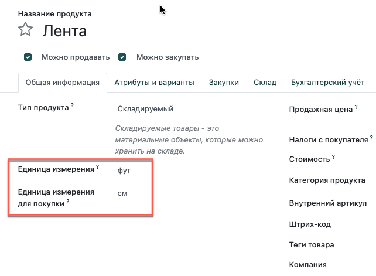

========================================================================
Когда следует использовать упаковку, единицы измерения или комплектацию?
========================================================================

Единица измерения
=================

Единица измерения определяет величину, используемую для обработки продукта.
Система позволяет использовать несколько единиц измерения для одного продукта.
В одной единице измерения вы можете управлять запасами на складе, а в другой
- закупать товар у поставщика.

Конвертация между различными единицами измерения выполняется
автоматически. Единственным условием является то, что все единицы измерения должны быть в
одной категории (штуки, вес, объем, длина...).

Упаковка
========

Упаковка - это тара (ящик, мешок, пакет и т.п.), в которую
вы помещаете один или несколько
продуктов из комплекта. Например, при приемке товара, вы
можете разделить товар на две равные части. При отчете будет учитываться
количество товара в каждом элементе упаковки. Данные по количеству
товара в упаковке будут занесены в базу данных системы.

Убедитесь, что в меню:
**Склад --> Настройки --> Настройки**, в разделе **Операции**,
активирована опция **Упаковка**.

Упаковка - это материальная оболочка, которая защищает ваш продукт. Если
вы продаете ноутбуки, комплектация компьютера включает зарядный кабель и инструкцию.

.. note::
        Еще одно полезное использование упаковки - при приемке продукта. Посредством
        сканирования штрих-кода упаковки, система добавляет количество единиц товара
        содержащихся в упаковке при комплектации.
