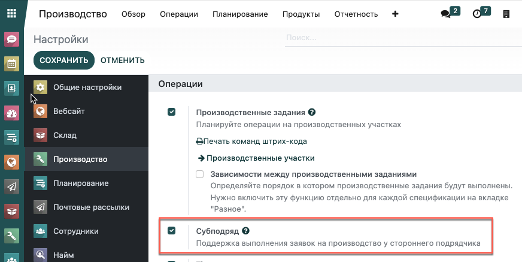

=======================================
Альтернативные производственные участки
=======================================

Производство нескольких различных продуктов одновременно в одном производственном участке
является распространенной проблемой многих предприятий. Несмотря на то, что сотрудники могут
использовать другой производственный участок вместо того, чтобы ждать, пока освободится первый, на практике
не всегда просто понять, какой участок занят. Поэтому правильное планирование ресурсов
в режиме реального времени иногда вызывает затруднения.

В Modooli вы можете настроить альтернативные производственные участки для решения этой проблемы. Программа автоматически
проверяет, какой участок занят, а какие аналогичные участки свободны и планирует производственные задания
с учетом анализа этих данных.

Таким образом, процесс производства становится более эффективным, так как оптимизируется использование
производственных участков.

Настройка производственных участков
===================================

Перейдите в меню: :menuselection:`Производство --> Настройки --> Настройки`. Активируйте функцию *Производственные задания*,
поставив галочку в соответствующем поле и нажмите *Сохранить*.

Затем, перейдите в меню: :menuselection:`Настройки --> Производственные участки` и создайте два новых
производственных участка. Добавьте второй производственный участок в качестве альтернативы к первому
и наоборот.

Далее, перейдите в меню: :menuselection:`Продукты --> Спецификации`, выберите необходимый продукт,
и добавьте эти производственные участки к операциям вашей спецификации.

Создание заявок на производство
===============================

Теперь, когда все настроено, вы можете создать *Заявки на производство*.
Перейдите в меню: :menuselection:`Операции --> Заявки на производство`, и нажмите **Создать**. Добавьте
продукт в заявку на производство и составьте календарный план. Заявки на производство будут доступны
в списке "Производственные задания" в меню: **Операции > Производственные задания**.

Каждая новая *Заявка на производство*, созданная до завершения
первой, будет запланирована в альтернативном рабочем центре.

.. note::
         Обратите внимание, что если вы добавите время после производства в производственный участок, у вас могут быть запланированы заявки на производство в альтернативном рабочем центре даже в том случает, если обычный центр свободен.
