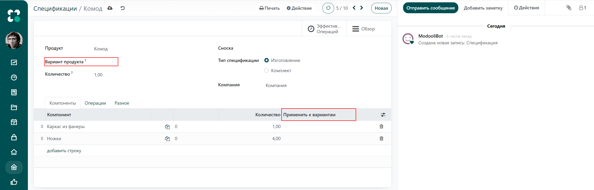
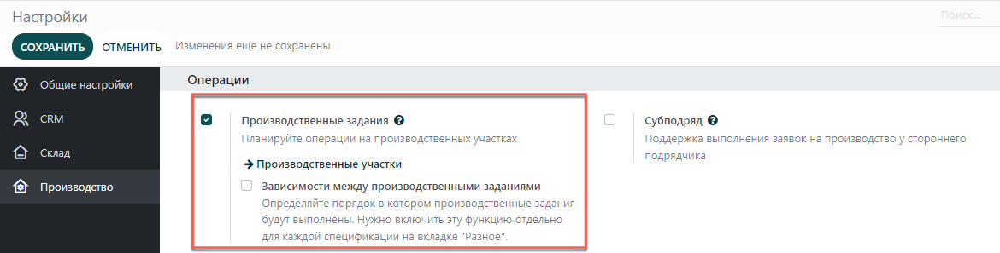

=====================
Создание спецификаций
=====================

*Спецификация* - документ, определяющий  состав какого-либо изделия. Может включать описание
работ (операции) и инструкции, необходимые для производственного процесса.

С помощью MRP-решения (планирование потребности в материалах) в системе **Модули**, к каждому изделию можно
привязать несколько спецификаций. Поэтому даже варианты одного изделия могут иметь
свою собственную спецификацию.

Настройка спецификации
======================

Самая простая спецификация - это документ, не включающий описание работ и каких-либо инструкций.
В этом случае  вы будете управлять производством, используя только
Производственные заказы.
Чтобы создать спецификацию из модуля *Производство*, перейдите в меню:
:menuselection:`Продукты --> Спецификации`.
Если вы нажмете на кнопку **Создать**, первое, что вам необходимо сделать, это указать
готовый продукт.
Для существующего продукта выберите его из списка.
Обратите внимание, что если вы используете карточку товара для создания
спецификации, то продукт уже задан.

Для стандартной спецификации, используемой по умолчанию, сохраните тип спецификации
- *Изготовление*.
Далее, укажите различные компоненты, из которых будет изготовлен конечный продукт, и их количество.
Вы можете создать компоненты по ходу работы в спецификации или создать продукты заранее,
перейдя в меню: :menuselection:`Продукты --> Продукты --> Создать`, и добавить их позже.

Использование одной спецификации для вариантов продукта
-------------------------------------------------------

Как уже говорилось ранее, *спецификации* могут быть также использованы для *вариантов продукта*.

Существуют два способа создания спецификации для соответствующих вариантов продукта.

Вы можете создать спецификацию для каждого варианта, указав вариант продукта
в специальном поле под названием продукта. Или использовать одну спецификацию, которая содержит
все компоненты. В таком случае, для каждого компонента укажите, к какому варианту он относится,
используя колонку *Применить к вариантам*, как показано ниже.

Добавление операций
===================

Вы также можете добавлять операции в *спецификацию*, если вы хотите,
чтобы работники выполняли определенные инструкции или для фиксации затраченного времени.
Чтобы использовать эту функцию, перейдите в меню: **Настройки --> Настройки**
и поставьте галочку в поле *Производственные задания*. Нажмите *Сохранить*.

Чтобы создать новую операцию, перейдите на вкладку *Операции* и нажмите *Добавить строку*.
В появившемся окне *Создать Операции* укажите название операции, производственный участок и
длительность. Как и для компонентов изделия, операции могут быть уникальны для вариантов продукта.

.. note::
         Каждая операция уникальна, так как она всегда связана с одной спецификацией. При этом,
         операции могут быть повторно использованы при создании новой спецификации с помощью функции *Копировать существующие операции*.

Добавление побочных продуктов
=============================

*Побочный продукт* - это продукт, который производится дополнительно к основному продукту в *спецификации*.
В отличие от основной продукции, в одной спецификации могут быть несколько побочных продуктов.

Чтобы добавить *побочные продукты* в *спецификацию*, вам необходимо активировать эту функцию
в настройках производства, поставив галочку в поле *Побочные продукты*.

Как только эта функция будет включена,
вы сможете добавлять побочные продукты в спецификацию.
Обратите внимание, что если в спецификации имеются операции, вам необходимо указать
к какой операции относится побочный продукт.
