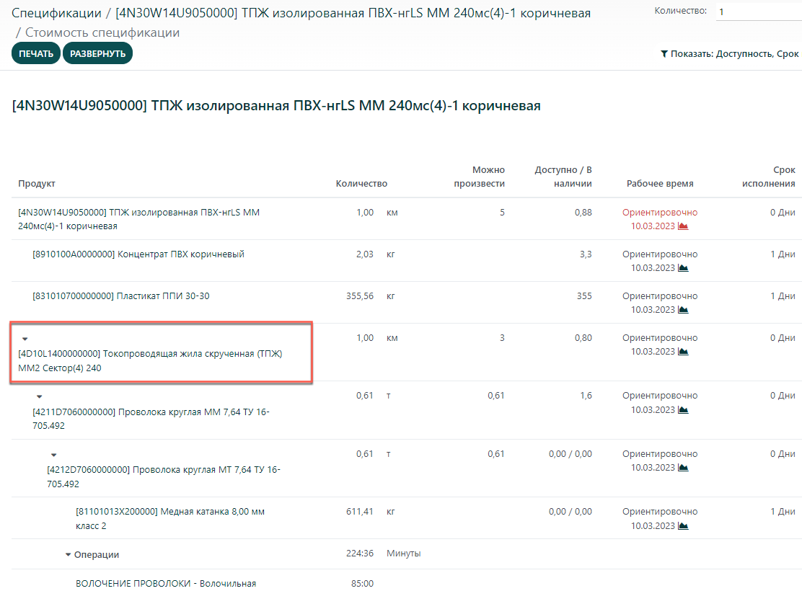

=========
Комплекты
=========

*Комплект* - это набор компонентов, имеющих
определенное назначение и в совокупности составляющих единое целое.
Использование комплектов целесообразно не только в продажах, но и для создания
более точных и эффективных спецификаций. Для использования комплектов, необходима установка
двух приложений: *Производство* и *Склад*.

Управление запасами комплектующих изделий
=========================================

Если вы хотите формировать комплекты по мере поступления заказов, и при этом управляете запасами только
комплектующих, вам необходимо использовать тип спецификации *Комплект* без
каких-либо производственных операций.

Продукт, использующий тип спецификации *Комплект* будет отображаться в одной строке в заявках
и заказах на продажу, но при этом в заказе на доставку каждая комплектующая будет
иметь отдельную строку.

Настройка
=========

В приложении *Производство* или *Склад*, в меню: **Продукты --> Продукты**
создайте каждый компонент продукта (как и любой другой продукт), затем создайте основной продукт
или комплект. Поскольку вы не можете отследить запасы комплектов, в поле *Тип продукта*
выберите *Потребляемый*.

Если вы используете англосаксонский бухгалтерский учет и хотите, чтобы при
выставлении счетов-фактур отражалась себестоимость реализованной продукции
(и только по этой причине), выберите тип продукта *Складируемый*.
Поскольку продукт из комплекта не может быть куплен, необходимо снять галочку в поле
*Можно продавать*. Маршрут
на вкладке *Склад* не имеет значения, так как при пополнении запасов учитывается только маршрут
компонентов.

Все остальные параметры продуктов комплекта могут быть изменены в соответствии с вашими предпочтениями.
Компоненты продукта не требуют особой настройки.

Как только продукты настроены, создайте *спецификацию* для комплекта. Добавьте каждый компонент
и его количество. Укажите тип спецификации *Комплект*. Все остальные параметры можно оставить
со значениями по умолчанию.

Управление запасами
===================

Если вы хотите управлять запасами *комплекта основного продукта*, используйте тип спецификации *Изготовление*
или *Субподряд*. В этом случае вы либо купите готовый продукт у своего субподрядчика, либо сделаете это
самостоятельно через заявку на производство. Поэтому тип продукта должен быть *Складируемый*, а тип
спецификации *Изготовление* или *Субподряд*.

Создание более точной спецификации
==================================

Как говорилось выше, спецификация комплекта может также использоваться для
создания более сложной спецификации.

Представьте, что детали персонального компьютера
являются частью другого конечного продукта. Было бы намного
яснее и проще, если бы все спецификации к комплекту были объединены
(как показано ниже) вместо добавления спецификаций для каждого компонента по отдельности.

.. image:: media/kit-bom4.png
    :align: center

Более наглядно это представлено в отчете "Структура спецификации", где можно
легко развернуть и скрыть конкретные спецификации на уровне комплекта или сборки.

При создании заявок на производство спецификация автоматически разворачивается для
отображения всех компонентов верхнего уровня и уровня комплекта.
Вы можете вернуться к спецификации в любой момент, поскольку она
остается доступной в форме заявки на производство.

Наконец, обратите внимание, что если в спецификации комплекта есть какие-либо операции,
они также будут добавлены в список заказов на разработку основного компонента.