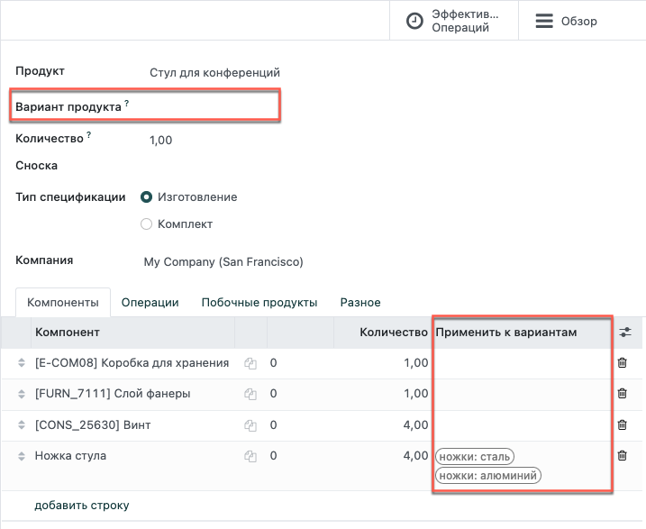

=================
Варианты продукта
=================

Odoo позволяет использовать одну спецификацию для нескольких вариантов
одного и того же продукта. Чтобы активировать варианты, в приложении *Склад*
перейдите в меню: :menuselection:``Настройки --> Настройки
--> Продукты` и поставьте галочку в поле *Варианты*.

Укажите какие компоненты спецификации должны быть использованы в
производстве каждого варианта продукта. Вы можете указать несколько
вариантов для каждого компонента. Если для компонента не указан вариант,
то этот компонент будет использоваться в спецификации всех вариантов.

При определении спецификаций вариантов для каждой строки, поле **Вариант продукта**
в основном разделе спецификации следует оставить пустым, как показано ниже.
Это поле используется при создании спецификации для одного конкретного варианта
продукта.

Обратите внимание, что тот же принцип применяется при настройки
операций и для производства побочных продуктов.
