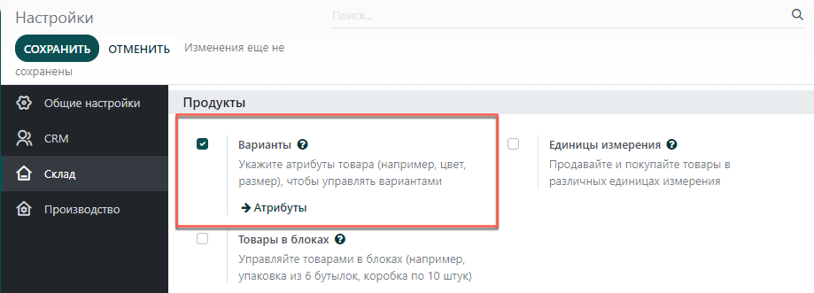

=================
Варианты продукта
=================

Система **Модули** позволяет использовать одну спецификацию для нескольких вариантов
одного и того же продукта. Чтобы активировать варианты, в приложении *Склад*,
перейдите в меню: :menuselection:`Настройки --> Настройки --> Продукты`
и поставьте галочку в поле *Варианты*.

Примените компоненты спецификации к вариантам продуктов
-------------------------------------------------------

Укажите какие компоненты спецификации должны быть использованы в
производстве каждого варианта продукта.
Для этого перейдите в меню: :menuselection:`Производство --> Продукты --> Спецификации`.

*Примечание:* Опция **Применить к вариантам** станет доступна как только вы включите функцию
**Варианты** в настройках приложения **Склад** (см. выше).

Создайте новую спецификацию или отредактируйте уже существующую спецификацию.
Если колонка **Применить к вариантам** не отображается, вы можете активизировать ее в настройках
таблицы.
Вы можете указать несколько
вариантов для каждого компонента. Если для компонента не указан вариант,
то этот компонент будет использоваться для всех вариантов продукта.

При определении вариантов для каждого компонента, поле **Вариант продукта**
в основном разделе спецификации следует оставить пустым, как показано ниже.
Это поле используется при создании спецификации для одного конкретного варианта
продукта.

.. image:: media/bom_2.png
    :align: center

Обратите внимание, что тот же принцип применяется при настройки
операций и для производства побочных продуктов.
