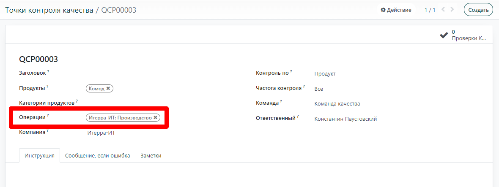

=================
Контроль качества
=================

Модуль **Качество** необходим для эффективного управления контролем качества продукции на вашем предприятии.
Эта функциональность позволяет зафиксировать выявленные несоответствия
качеству еще до приемки продукции на слад. Таким образом, система
минимизирует риск поставки или производства бракованных изделий, способствуя повышению качества и
совершенствованию элементов производственной цепочки.

Чтобы использовать функцию контроля качества, необходимо определить *Точки контроля качества*.
Для этого перейдите в меню: :menuselection:`Качество
--> Контроль качества --> Точки контроля качества` и нажмите на кнопку **Создать**.
Если проверка качества распространяется только на определенные продукты или категории продуктов,
вы можете также указать их во время настройки.

При приемке продукции от субподрядчика, в поле **Операции** необходимо установить значение **Приемка**.
Для всех остальных параметров действуют те же принципы.

Таким образом, система автоматически создает проверку качества каждый раз при приемке или производстве готовой
продукции.
Обратите внимание, что в поле **Раздел** могут быть выбраны разные виды контроля качества, а также несколько
точек контроля качества могут быть установлены для одного и того же типа операции.

