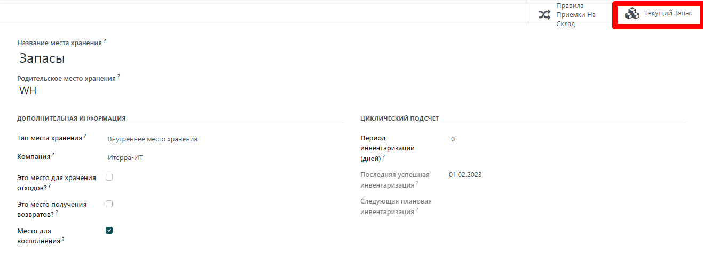

=========================
Субподрядное производство
=========================

Передать на аутсорсинг производственные нужды компании
не так-то просто. Для правильной организации этого процесса, вам необходимо:

- управлять запасами сырья субподрядчика
- отгружать сырье субподрядчикам в нужное время
- контролировать качество поступающих товаров
- контролировать счета субподрядчиков

Функция субподрядчика MRP (англ. Material Requirements Planning —
планирование потребности в материалах), позволяет легко управлять этими процессами.

Настройки
=========

Функция субподряда доступна в меню: :menuselection:`Производство
--> Настройки --> Настройки`. Поставьте галочку в поле *Субподряд*.

Чтобы определить, должен ли продукт быть субподрядным, используйте *Тип спецификации* *Субподряд*.

Для создания новой *спецификации*, перейдите в меню: :menuselection:`Производство --> Продукты -->
Спецификации` и нажмите на кнопку *Создать*. Перечислите компоненты,
необходимые субподрядчику для производства продукта. Чтобы рассчитать все затраты,
необходимо указать все компоненты и даже те,
которые получены непосредственно от субподрядчика.

Установив в поле *Тип спецификации* значение *Субподряд*, укажите одного или
несколько субподрядчиков.

Порядок действий
================

Чтобы сообщить субподрядчику, сколько продукции вам необходимо, создайте и
отправьте ему заказы на поставку. Для этого перейдите в приложение *Закупки* и
создайте новый заказ на поставку. Обязательно отправьте заказ на поставку поставщику, который
указан как субподрядчик в *спецификации* этих продуктов.

Как только заказ на поставку подтвержден (1), создается отложенный чек. Когда
продукция будет получена, подтвердите чек (2), указав фактическое
количество. Таким образом, Oddo выполняет следующие операции:

- Расходует соответствующие компоненты в месте нахождения субподрядчика, основываясь на *спецификацию* и ваши данные (3);

- Производит готовую продукцию в месте расположения субподрядчика (4);

- Перемещает продукцию с места расположения субподрядчика в вашу компанию
  в соответствии с подтвержденной накладной (5).

.. note::
      Заказ по поставку не необязателен. Если вы создадите накладную вручную, с указанием
      субподрядчика, Odoo все равно выполнит все перемещения. Это может быть полезно в том случае, если
      субподрядчик не выставляет счет по фиксированной цене за товар, так как время
      и использованные материалы могут варьироваться.

Оценка запасов
==============

Стоимость изготовленного продукта "C" определяется как:

**C = A + B + s**.

С:

- **A**: Стоимость сырья, поступающего из вашей компании;

- **B**: Стоимость сырья, полученного непосредственно от
       субподрядчика;

- **s**: Стоимость услуг субподрядчика.

Отправка сырья субподрядчикам (**A**) не влияет на оценку запасов,
так как компоненты спецификации по-прежнему оцениваются как часть
ваших запасов. Это управляется путем определения *Места хранения субподряда* как
*Внутреннее место хранения*.

Цена поставщика, установленная в форме продукта C, должна быть той, которую нужно
оплатить субподрядчику за его материалы и услуги: **B +
s**. Себестоимость продукта должна быть: **A + B + s**, это стоимость продукта в бухгалтерском учете.

В конечном итоге, счет субподрядчика совпадает с заказом на поставку, в котором предложенная стоимость зависит
от цены готовой продукции C.

.. note::
      Если управление пополнением запасов сырья **B** в месте хранения
      субподрядчика не требуется, просто включите расходы
      **В** в стоимость услуг субподрядчика **s** и удалите продукты
      *В* из *спецификации*.

Отслеживание
============

В случае, если полученная от субподрядчика продукция содержит отслеживаемые
компоненты, их серийные номера или номера партий должны быть указаны во время
приемки товара.

В этом случае при приемки продукции нажмите на кнопку *Записать компоненты* и в новом окне
укажите серийные номера/номера партий компонентов.
Если готовый продукт также отслеживается, его серийный номер/номер партии может быть указан в этом окне.

В целях аудита можно проверить номера партий, указанных в накладной,
нажав соответствующую иконку справа в строке готовой продукции.

Обратите внимание, что если спецификация субподрядчика создана для продукта, который не отслеживается,
вы все равно можете опционально зарегистрировать компоненты в каждой строке перемещения
при получении конечного продукта.
Это позволит увидеть приблизительный расход компонентов
на месте субподрядчика.

Таким образом, приемка неотслеживаемых продуктов возможна с помощью меню *Установите количество*
или в строке каждого компонента.

Автоматизация пополнения запасов субподрядчиков
===============================================

Существует два способа автоматизации снабжения сырьем
субподрядчиков при закупке конечного продукта. Выбор способа
зависит от того, хотите ли вы, чтобы материалы проходили транзитом через ваш
склад или нет. Оба этих метода подразумевают первоначальный заказ субподрядчику,
который создает потребность в сырье для субподрядчика.

Если вы снабжаете субподрядчика сырьем со своего склада,
вам необходимо активировать маршрут 'Пополнение запасов субподрядчика по заказу' в форме продукта.
Если это компонент, который вы покупаете у поставщика, маршрут покупки
также должен быть активирован.

Если вы хотите, чтобы ваш поставщик поставлял субподрядчику продукцию напрямую, вам необходимо
выбрать опцию 'Отгрузка субподрядчику по заказу'. Для того чтобы
эта опция была активна в форме продукта, вы должны сначала активировать опцию дропшиппинга в меню: :menuselection:`Закупки --> Настройки --> Настройки -->
Дроп-шиппинг`.
После утверждения заказа субподрядчику, этот маршрут создаст запрос на поставку товара от поставщика к
субподрядчику. Обратите внимание, что в данном случае не нужно выбирать маршрут покупки, так как
сам по себе маршрут дропшиппинга уже является покупкой.

Наконец, если вы хотите отслеживать эти запасы в месте хранения субподрядчика,
необходимо активировать опцию *Мульти-локации* в меню :menuselection:`Склад -->
Настройки --> Настройки --> Места хранения`.

Из формы местоположения вы сможете получить доступ к текущему запасу.

Пополнение запасов вручную
--------------------------

Вы также можете пополнять запасы своих субподрядчиков вручную.

Если вы хотите отправлять компоненты субподрядчику в удобное для вас время,
выберите тип операции 'Пополнение субподрядчика' в модуле *Склад*,
и создайте комплектацию, указав, какому субподрядчику вы осуществляете поставку.

Кроме того, вы можете попросить поставщика пополнить запасы для вашего субподрядчика вручную,
создав заказ на поставку с указанем типа дропшиппинга, где в качестве адреса доставки является местоположение
субподрядчика.
