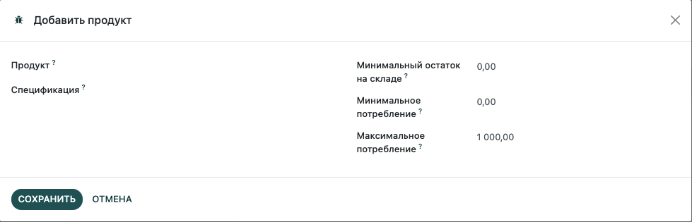
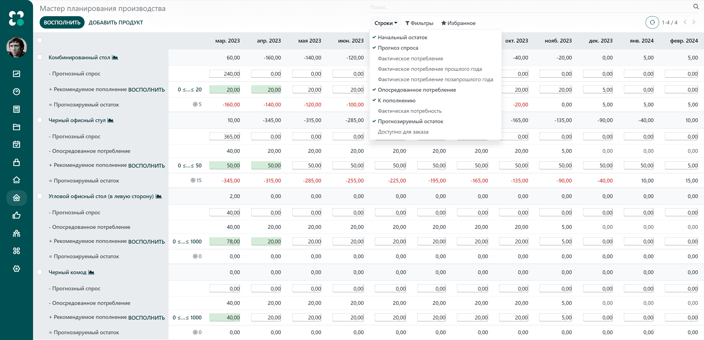
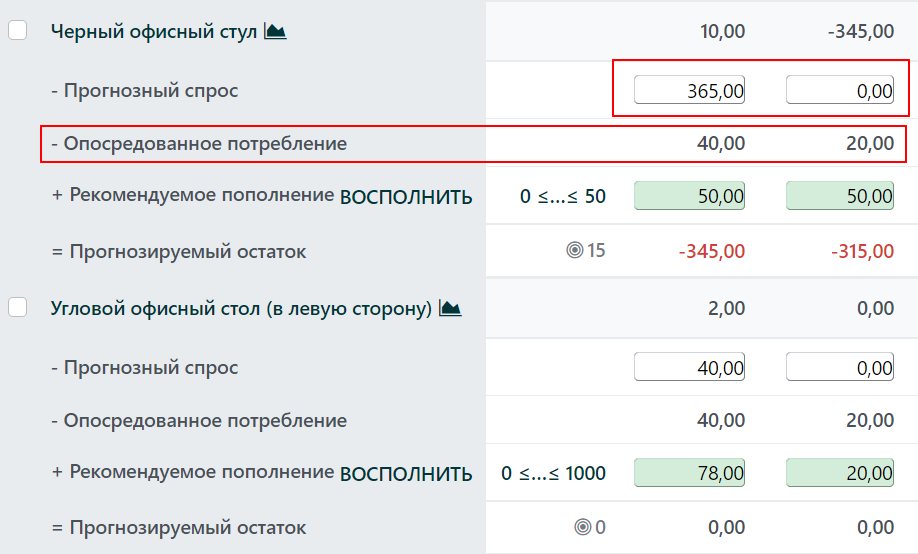
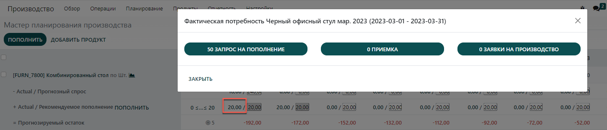

================================
Мастер планирования производства
================================

Мастер планирования производства (МПП) - это ценный инструмент планирования производства
на основе анализа данных и прогнозов.

Настройки
=========

Перейдите в меню: :menuselection:`Производство --> Настройки --> Настройки` и
в разделе **Планирование** поставьте галочку в поле **Мастер планирования производства**.
Нажмите **Сохранить**.

.. tip::
        В настройках МПП, вы можете установить временной диапазон (ежемесячно/еженедельно/ежедневно)
        и количество периодов для отображения.

Далее, перейдите в меню: :menuselection:`Планирование --> Мастер планирования производства`
и нажмите на кнопку **ДОБАВИТЬ ПРОДУКТ**. Теперь вы можете определить минимальный
остаток на складе (остаток, который всегда должен быть под рукой к концу периода), а также
минимальное и максимальное количество, которое должно восполняться в каждом периоде.

На странице **Мастер планирования производства** используйте
фильтр **Строки**, чтобы определить какую информацию отобразить в МПП. Например,
строка *Фактическое потребление* покажет какое количество продуктов уже было продано
за определенный период или строка *Доступно для заказа* отобразит что еще
может быть продано в течение того же периода. Вы также можете скрыть
ненужные строки, убрав галочку с соответствующего фильтра.

Прогноз спроса и восполнение
============================

Следующим шагом является определение прогнозируемого спроса за выбранный период.
Для этого отобразите строку **Прогноз спроса**. Теперь вы можете в любое время
сопоставить прогноз спроса с фактической потребностью по каждому из продуктов.
Прогноз спроса для готового продукта повлияет на опосредованное потребление
его компонентов.

Как только прогнозируемый спрос установлен, система автоматически посчитает
рекомендуемое для пополнения количество продуктов.
Рекомендуемое пополнение, которое вы планируете восполнить за счет времени ожидания
(время ожидание продавца или время на производство) отображается в зеленой ячейки.
Нажмите на кнопку **Восполнить**, чтобы пополнить остатки.

В зависимости от настроек продукта (покупка или производство), система автоматически
создаст запрос на закупку или заявку на производство. Эту информацию можно легко
отследить, нажав на ячейку в поле  **Фактическая потребность**.

В случае, если вы вручную захотите отредактировать количество в поле **Рекомендуемое
пополнение**, рядом с ячейкой появится крестик. Если вы захотите вернуть автоматически
вычисленное системой значение, просто нажмите на этот крестик.

Цветовое обозначение ячеек
==========================

Ячейки, которые являются частью строки **Рекомендуемое пополнение** могут иметь
различные цвета в зависимости от ситуации:

-  **Зеленый**: количество продукции, которое необходимо восполнить для достижения необходимого остатка с учетом прогноза спроса и опосредованного потребления.

-  **Серый**: заявка на восполнение уже сформирована и количество все еще соответствует текущим данным.

-  **Красный**: заявка на восполнение уже сформирована и количество слишком большое с учетом текущих данных.

-  **Oранжевый**: заявка на восполнение уже сформирована и количество слишком мало с учетом текущих данных.

Строка **Прогнозируемый остаток** также может содержать яцейки красного цвета, обозначающие
что остаток будет отрицательным в течение рассматриваемого периода.

Что делать если фактический спрос выше прогнозируемого?
------------------------------------------------------

В таком случае вы можете увеличить прогноз спроса. Это повлияет на количество для
восполнения остатка. Ячейка станет оранжевой и вы сможете запустить восполнение.

Что делать если фактический спрос ниже прогнозируемого?
-------------------------------------------------------

Вы можете уменьшить прогноз спроса. Ячейка станет красной, информируя вас о том, что
закано больше, чем запланировано. Если еще не поздно, вы можете отменить заявки на закупку
или на производство вручную.

Что если продукт был добавлен по ошибке в МПП?
----------------------------------------------

Вы можете просто удалить продукт из списка МПП. Для этого поставьте галочку рядом с продуктом и из меню **Действие**
выберите **Удалить**.
