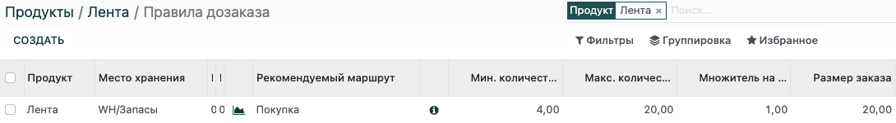

================
Правила дозаказа
================

Чтобы быть уверенным, что у вас никогда не закончится товар, вы можете установить
*Правила дозаказа*.
Благодаря этим правилам Odoo автоматизирует пополнение запасов,
когда они достигают установленного количества или
при создании заказа на продажу.

.. important:: Вам необходимо установить приложение *Склад*, чтобы использовать функцию дозаказа.

Настройка продукта на складе
============================

Откройте или создайте продукт с указанием *Типа продукта*: *Складируемый*.

Поскольку вы покупаете этот продукт у поставщика, перейдите на вкладку *Закупки* и добавьте поставщика,
нажав *Добавить строку* в таблице. Вы можете добавить несколько поставщиков, но убедитесь,
что они перечислены в правильном порядке, поскольку правила дозаказа
всегда используют первого поставщика в списке. Вы можете добавить цену, но это
не влияет на правила дозаказа.
Кроме того, вы можете добавить минимальное количество товара для заказа, чтобы извлечь выгоду
из цены.

.. note::
   Если количество, которое необходимо дозаказать, не совпадает с указанным минимальным количеством, Odoo выбирает следующего поставщика в списке. Если у вас нет другого поставщика в списке, правило дозаказа
   не будет работать. Поэтому вы можете добавить одного и того же поставщика несколько раз с разной ценой
   для разных количеств.

.. tip::
   По умолчанию создается черновик заказа на поставку. Однако, если вы включили функцию *Purchase
   Agreements*, вы можете *Propose a call for tenders*. Для получения дополнительной
   информации смотрите :doc:`.../manage_deals/agreements`.

Далее, убедитесь, что на вкладке *Склад* в форме продукта выбран правильный маршрут. Если вы
создали продукт в приложении "Закупки", то по умолчанию будет выбран маршрут *Покупка*. Если вы
хотите переправить свой продукт, выберите маршрут *Дропшип*.

Настройка правил дозаказа
=========================

Откройте необходимый продукт и нажмите на кнопку *Правила дозаказа*.
На странице правил дозаказа продукта, нажмите на кнопку *Создать*.

.. tip::
   Вы также можете создавать правила дозаказа в меню: :menuselection:`Склад --> Настройки -->
   Правила дозаказа" и в меню: :menuselection:`Склад --> Операции --> Пополнение`. По
   умолчанию, страница *Пополнение* представляет собой сводку всех продуктов, которые вам возможно необходимо
   закупить для выполнения заказов на продажу. С этой страницы вы можете заказать
   продукт или автоматизировать все заказы на этот продукт, включая будущие заказы.

Определите количества
---------------------

Вы можете устанавливать **минимальное количество**, которое всегда должно быть на складе.
После установки этого параметра, если количество товара на складе опустится ниже
минимального количества, и если вы выбрали маршрут "Покупка",
автоматически формируется заказ
для достижения установленного минимального количества.
Помимо этого учитывается любое дополнительное количество, необходимое для выполнения заказов на продажу, например.

Если вы установите **максимальное количество**, то каждый раз, когда товар должен быть пополнен,
будет перезаказано достаточное количество товара, чтобы достичь максимального количества.

Если вы хотите заказывать только определенное количество, необходимое, например, для продажи,
установите минимальное и максимальное значение **ноль**. В таком случае правило дозаказа будет
использовать только то количество, которое указанно в заказе на продажу.

Вы также можете добавить **кратное количество**, чтобы заказывать товары партиями
определенного количества.
В таблице нажмите на выпадающее меню дополнительных столбцов и выберите *Множитель на количество*,
чтобы отобразить столбец. Обратите внимание, что вы можете превысить максимальное количество,
если установите кратное количество, так как Odoo будет формировать заказ таким образом,
чтобы достичь максимальное количества и соблюсти установленное кратное значение.

.. note:: Если продукт имеет несколько маршрутов на вкладке "Склад"в форме продукта, выберите
   *Предпочтительный маршрут* в правиле дозаказа, добавив столбец *Предпочтительный маршрут* в таблице.

.. Add link when inventory doc on replenishment is updated for v14. .. seealso:: - :doc:`../../..inventory/xxx/xxx`