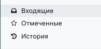
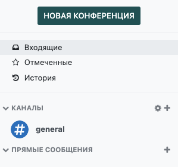

==============
Начало общения
==============

Панель быстрого доступа
======================

Используйте панель быстрого доступа для оперативного поиска и просмотра нужных вам сообщений.
Папка *Входящие* содержит только новые сообщения и уведомления. В папку *Отмеченные* перемещаются сообщения, помеченные звездочкой, а *История* содержит уже прочитанные сообщения.

Как начать беседу
=================

Чтобы начать новый чат или найти беседу, перейдите в раздел *Прямые сообщения* и нажмите на значок *+*. В появившемся окне
введите имя пользователя.
Вы также можете добавить участников к вашей беседе, используя значок *Добавить участников* в правом верхнем углу окна чата.

Раздел *Каналы* позволяет создавать :doc:`публичные и частные каналы <team_communication>` и общаться с пользователями в канале по определенной тематике.

Кнопка *Новая конференция* на боковой панели модуля позволяет быстро запустить аудио или видео конференцию. Вы можете пригласить
любое количество участников, выбрав их из списка пользователей и нажав на кнопку *Пригласить в групповой чат*.
У вас также есть отличная возможность пригласить партнеров и других незарегистрированных в системе пользователей по ссылке-приглашению.

Строка быстрого поиска
======================

Как только боковая панель *Общения* будет содержать как минимум 20 каналов, прямых сообщений и бесед,
станет доступной строка *Быстрый поиск...*. Этот удобный фильтр позволяет быстро найти нужную беседу.

.. seealso::
   - :doc:`get_started`
   - :doc:`team_communication`
   - :doc:`chat_features`

