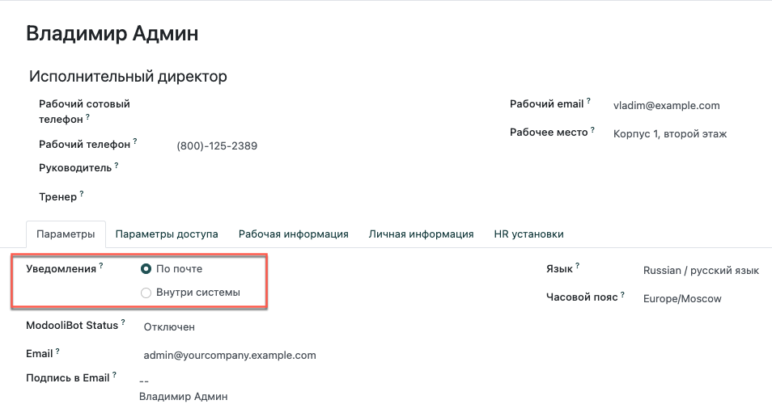
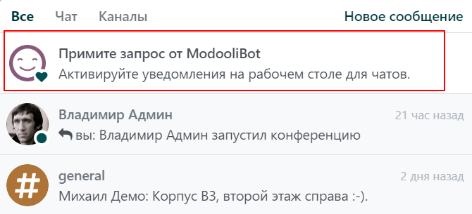

====================
Настройки параметров
====================

.. _discuss_app/notification_preferences:

Зайдите в раздел *Мои данные* и выберите подходящий способ уведомлений.

| По умолчанию выбрана опция *По почте*, поэтому все сообщения, заметки и уведомления, в которых вы были упомянуты или за которыми вы следите,
  будут приходить по электронной почте. При выборе *Внутри системы* они отображаются в приложении *Общение*, в папке *Входящие*.

При первом входе в учетную запись, ModooliBot отправляет вам запрос на разрешение
получать уведомления о чатах на рабочем столе. Если запрос на разрешение принят, то
вы будете получать push-уведомления в меню *Беседы* во всех модулях системы.

         notifications for Odoo Discuss

.. tip::
   Чтобы перестать получать уведомления на рабочем столе, сбросьте настройки уведомлений в браузере.

.. seealso::
   - :doc:`direct_messages`
   - :doc:`team_communication`
   - :doc:`chat_features`
