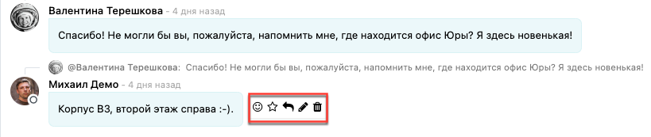
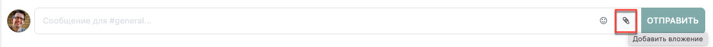
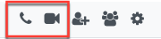
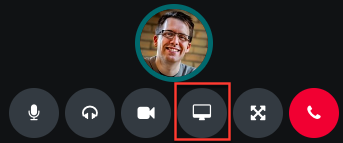

================
Возможности чата
================

Modooli Общение - это мощный инструмент с простым интерфейсом. Окно взаимодействия чата
позволяет осуществлять целый ряд задач:

- обмениваться текстовыми сообщениями
- проводить вебинары, аудио и видеоконференции
- отправлять реакцию, отвечать на конкретные сообщения и добавлять в Избранное
- делиться файлами и изображениями
- проводить демонстрацию экрана
- приглашать пользователей системы, а также сторонних пользователей в групповой чат или конференцию
- делать упоминания в чате
- просматривать статус пользователя и осуществлять переход в профиль

Далее более подробно рассмотрим некоторые из этих функций.

Реакция на сообщение
--------------------
Для отправки реакции, наведите курсор мыши на сообщение и
выберите одно из следующих доступных действий: отреагировать Emoji, добавить в Избранное, ответить, отредактировать или удалить.

*Примечание*: Функции редактирования и удаления доступны только для сообщений, отправленных лично вами.

Обмен файлами
-------------
Modooli чат позволяет обмениваться файлами и изображениями разного формата. Для отправки нескольких файлов одновременно,
нажмите на значок *Добавить вложения* в области ввода нового сообщения.

В появившемся окне выберите необходимые файлы, удерживая при этом клавишу Shift,
или добавьте файлы поочередно. Также можно перетащить файлы в область создания сообщения.
Вы можете просматривать и удалять прикрепленные файлы перед отправкой. Чтобы скачать отправленный вам файл,
нажмите *Скачать*.

Аудио/видео звонок
------------------
Чтобы начать аудио или видео звонок, нажмите на соответствующую иконку в правом верхнем углу окна чата.
Эта функция также позволяет в любой момент беседы переключать режимы аудио/видео звонка.

Демонстрация экрана
-------------------
Воспользуйтесь удобной функцией демонстрации экрана во время звонка или конференции.
Для этого нажмите кнопку *Демонстрация экрана*, выберите часть экрана для демонстрации и нажмите *Поделиться*.
Чтобы остановить демонстрацию экрана, еще раз нажмите кнопку *Демонстрация экрана*.

Добавление пользователей
------------------------
Чтобы пригласить в чат еще одного собеседника, нажмите на кнопку *Добавить участников* в правом
верхнем углу окна чата. Выберите необходимых пользователей среди ваших коллег из списка и нажмите на
кнопку *Пригласить в групповой чат*. Вы также можете добавлять в чат партнеров или сторонних людей,
используя ссылку-приглашение.

Упоминания в чате
-----------------

| Чтобы упомянуть пользователя в чате, введите имя пользователя *@user-name*; чтобы сослаться на канал, введите
  название канала *#channel-name*.
| Упомянутому пользователю будет отправлено уведомление в папку *Входящие* или по почте, в зависимости от настроек.

.. tip::
   Когда упоминается пользователь, поиск пользователя предлагает значения, основываясь на данные подписчиков и
   *Сотрудников*. Если введенное имя не совпадает с именем подписчика или сотрудника, то область поиска переходит ко всем партнерам.

Статус чата
-----------

Полезно узнать, чем заняты коллеги и как быстро они могут отвечать на сообщения, проверив их *Статус*.
Статус отображается слева от имени контакта на боковой панели *Общение*.

- Зеленый = онлайн
- Оранжевый = в сети
- Белый = не в сети
- Самолет = вне офиса

.. seealso::
   - :doc:`team_communication`

