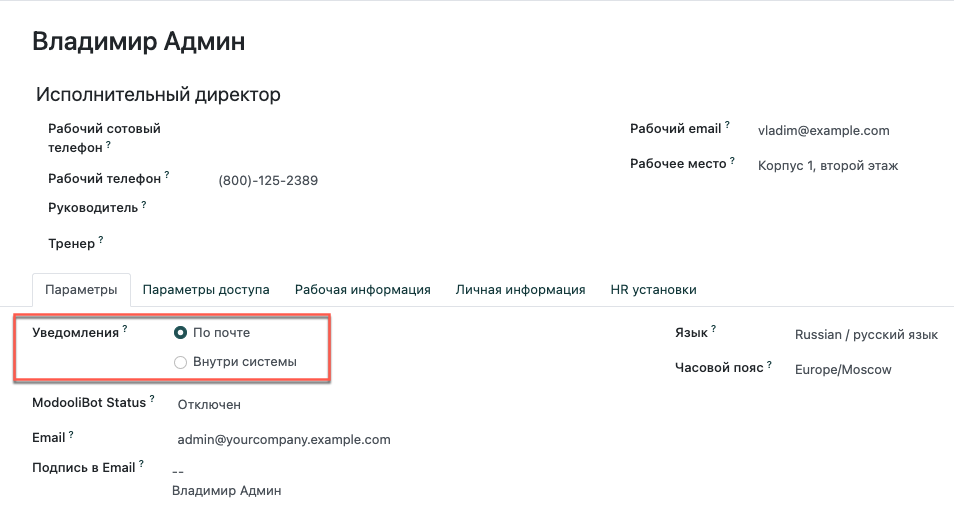
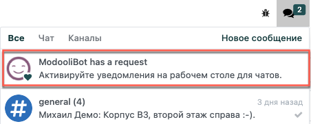

===============================
Начало работы с модулем Общение
===============================

Модуль *Общение* это простое в использовании приложение для обмена сообщениями и звонками.
Оно объединяет всю коммуникацию вашей организации и интегрируется со всеми модулями.
*Общение* позволяет вести беседу в окне чата из любого модуля, а также легко управлять
сообщениями и уведомлениями непосредственно в самом приложении. Создавайте каналы для групповых чатов,
делитесь информацией, проектами, файлами, определяйте приоритеты задач, всегда оставайтесь на связи
и многое другое с помощью удобного и легкодоступного интерфейса.

.. _discuss_app/notification_preferences:

Настройка параметров
====================

Зайдите в раздел *Мои данные* и выберите подходящий способ уведомлений.

| По умолчанию выбрана опция *По почте*, поэтому все сообщения, заметки и уведомления, в которых вы были упомянуты или за которыми вы следите,
  будут приходить по электронной почте. При выборе *Внутри Odoo* они отображаются в приложении *Общение*, в папке *Входящие*.

При первом входе в учетную запись, ModooliBot отправляет вам запрос на разрешение
получать уведомления о чатах на рабочем столе. Если запрос на разрешение принят, то
вы будете получать push-уведомления в меню *Беседы* во всех модулях системы.

         notifications for Odoo Discuss

.. tip::
   Чтобы перестать получать уведомления на рабочем столе, сбросьте настройки уведомлений в браузере.

Панель бытрого доступа
======================

Используйте панель быстрого доступа для оперативного поиска и просмотра нужных вам сообщений.
Папка *Входящие* содержит только новые сообщения и уведомления. В папку *Отмеченные* перемещаются сообщения, помеченные звездочкой, а *История* содержит уже прочитанные сообщения.

