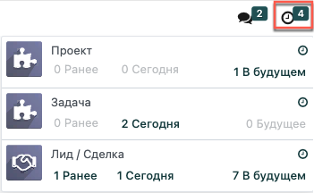
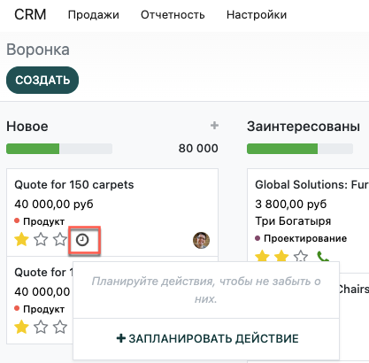

=====================
Планирование Действий
=====================

Когда вы планируете деятельность организации, вы минимизируете риск неэффективного управления,
поскольку даете четкие указания
на ход дальнейших действий. Планирование исключает бесполезную активность и
вероятность дублирования действий между членами команды.

Где я могу увидеть календарное планирование?
============================================

Доступ и управление вашей активностью осуществляется с помощью меню *Действия* на рабочем столе.

Планирование действий
=====================

Вы можете планированить и управлять своей активностью, нажав на *Планировать действия* в чаттере,
или с помощью рабочей доски.

Настройка видов активности
--------------------------

По умолчанию в Odoo доступно несколько типов действий (звонок, Email, встреча и т.д.). Однако,
вы можете установить новые, перейдя в меню: :menuselection:`Настройки --> Типы действий`.

.. tip::
   Если вам нужно создать тип действия, используя календарный план, убедитесь, что в поле *Действия* выбрана опция
   *Встреча*.

Как порекомендовать дальнейшие действия
---------------------------------------

Чтобы определить ход действий, установите необходимые параметры в разделе
*Следующее действие*.

После выполнения следующих действий, выберите *Done & Schedule Next*, и вам будут предложены следующие шаги.

.. image:: media/schedule_recommended_activity.png
   :align: center
   :alt: View of an activity being schedule emphasizing the recommended activities field being
         shown for Odoo Discuss

.. seealso::
   - :doc:`get_started`
   - :doc:`team_communication`
