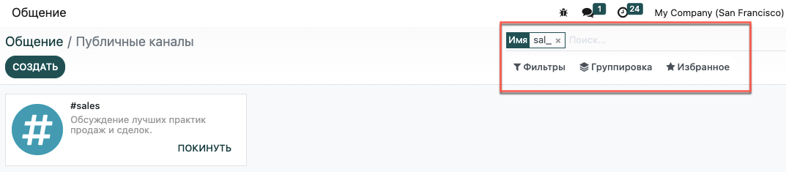

======
Каналы
======

Вы можете использовать каналы для организации обсуждений между разными командами,
отделами, проектами или любыми другими группами, в которых необходимо регулярное общение.
Эта функция позволяет держать ваших коллег в курсе последних событий.

Публичные и частные каналы
==========================

Канал *Публичный* доступен каждому, в то время как канал *Частный* виден только приглашенным
пользователям.

.. tip::
   Публичный канал целесообразно использовать, когда доступ к информации необходим многим сотрудникам
   (например, новости компании). Частный канал необходим в том случае, если информация должна быть ограничена
   для определенных групп (например, для конкретного отдела).

Настройка канала
================

Вы можете настроить название канала, описание, почтовый псевдоним и параметры конфиденциальности, нажав на значок
*Настройка канала* рядом с названием канала.

.. image:: media/channel_settings.png
   :align: center
   :alt: View of a channel’s settings form in Odoo Discuss

Конфиденциальность и участники
------------------------------

| Параметры поля *Кто может присоединиться к группе?* позволяют установить,
  какие пользователи будут иметь доступ к каналу.
  Обратите внимание, что опция *Каждый* дает возможность другим пользователям следить за частным каналом и присоединяться
  к нему, также как и к публичному каналу.
| Если вы выбрали опцию *Только приглашенные*, перейдите на вкладку *Участники*, чтобы добавить членов группы или
  перейдите на главную страницу "Общение", выберите канал и нажмите *Добавить участников*.

Для *Выбранной группы пользователей*, опция *Автоматическая подписка на группы* автоматически добавляет ее членов
в качестве подписчиков. Другими словами, функция *Авторизованная группа* ограничивает
доступ пользователей к каналу, а функция *Автоматическая подписка на группы* добавляет пользователей
в качестве участников группы.

Использование канала для рассылки
---------------------------------

| Выбор опции *По почте* настраивает канал на работу в качестве списка рассылки.
| При включении этой опции сообщения должны пройти модерацию, т.е. должны быть одобрены
  перед отправкой.

.. image:: media/pending_moderation.png
   :align: center
   :alt: View of a message with a pending moderation status in Odoo Discuss

| На вкладке *Модерация* выберите необходимое количество модераторов и опцию автоматического уведомления.
| Отметьте галочкой поле *Отправлять инструкции новым подписчикам*, чтобы автоматически отправлять инструкции новичкам.

.. image:: media/moderation_settings.png
   :align: center
   :alt: View of a channel’s settings form emphasizing the tab moderation in Odoo Discuss

Модераторы могут: *Принимать*, *Отклонять*, *Сбрасывать*, *Всегда разрешать* или *Запрещать* сообщения.

.. image:: media/moderate_messages.png
   :align: center
   :alt: View of a message to be moderated in Odoo Discuss

.. note::
   Участники канала рассылки получают сообщения по почте независимо от
   способа уведомлений, который они выбрали в своих настройках.

После модерации канала, меню *Бан-лист* позволяет добавлять адреса электронной почты для запрета
отправки сообщений определенным пользователям.

.. image:: media/ban_list.png
   :align: center
   :alt: View of a channel’s setting form emphasizing the ban Lists menu in Odoo Discuss

Поиск нужных каналов
====================

| Вы можете присоединяться или покидать публичные каналы, нажав *Каналы* на боковой панели.
| Применяйте и сохраняйте критерии поиска для дальнейшего использования. Подчеркивание *(_)* в
  поисковой строке может служить для обозначения подстановочного знака (одно подчеркивание = один символ).

.. seealso::
   - :doc:`get_started`
   - :doc:`plan_activities`