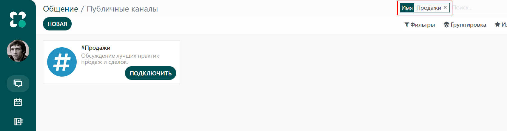

======
Каналы
======

Вы можете использовать каналы для организации обсуждений между разными командами,
отделами, проектами или любыми другими группами, в которых необходимо регулярное общение.
Эта функция позволяет держать ваших коллег в курсе последних событий.

Публичные и частные каналы
==========================

Канал *Публичный* доступен каждому, в то время как канал *Частный* виден только приглашенным
пользователям.

.. tip::
   Публичный канал целесообразно использовать, когда доступ к информации необходим многим сотрудникам
   (например, новости компании). Частный канал необходим в том случае, если информация должна быть ограничена
   для определенных групп (например, для конкретного отдела).

Настройка канала
================

Вы можете настроить название канала, описание, почтовый псевдоним и параметры конфиденциальности, нажав на значок
*Настройка канала* рядом с названием канала.

Конфиденциальность и участники
------------------------------

Для *Авторизованной группы пользователей*, опция *Автоматическая подписка на группы* автоматически добавляет ее членов
в качестве подписчиков. Другими словами, функция *Авторизованная группа* ограничивает
доступ пользователей к каналу, а функция *Автоматическая подписка на группы* добавляет пользователей
в качестве участников группы.

Поиск нужных каналов
====================

| Вы можете присоединяться или покидать публичные каналы, нажав *Каналы* на боковой панели.
| Применяйте и сохраняйте критерии поиска для дальнейшего использования. Подчеркивание *(_)* в
  поисковой строке может служить для обозначения подстановочного знака (одно подчеркивание = один символ).

.. seealso::
   - :doc:`get_started`
   - :doc:`direct_messages`
   - :doc:`chat_features`