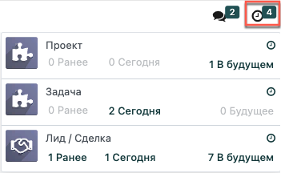
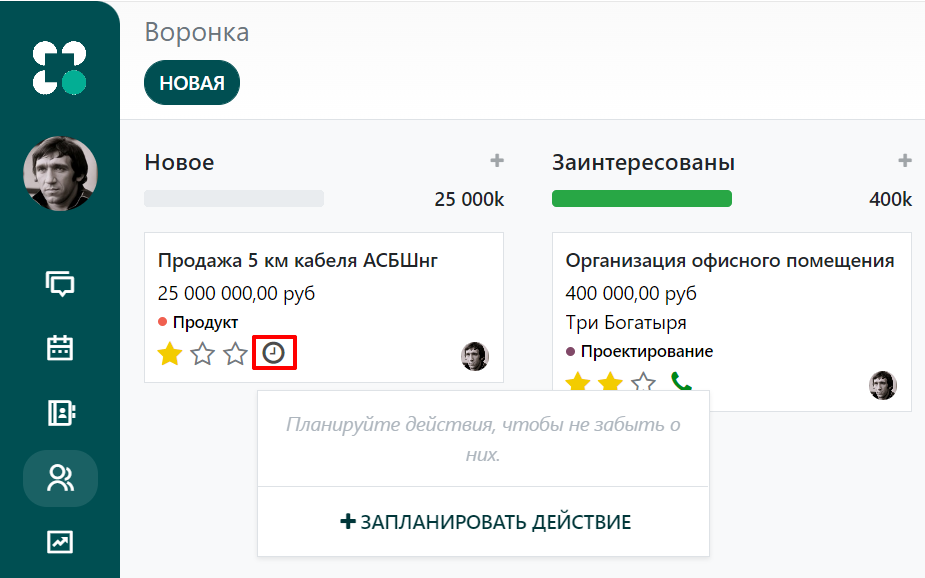
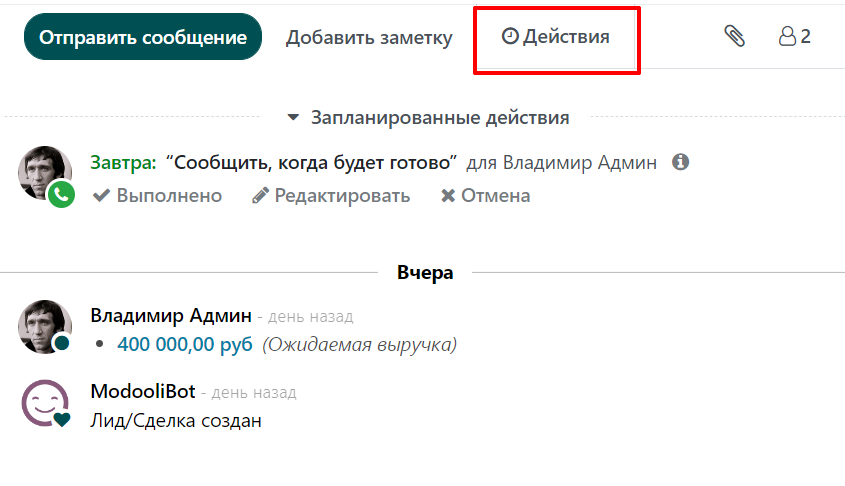
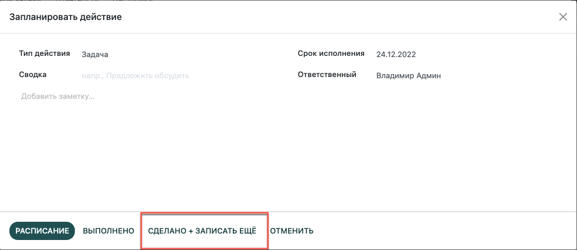
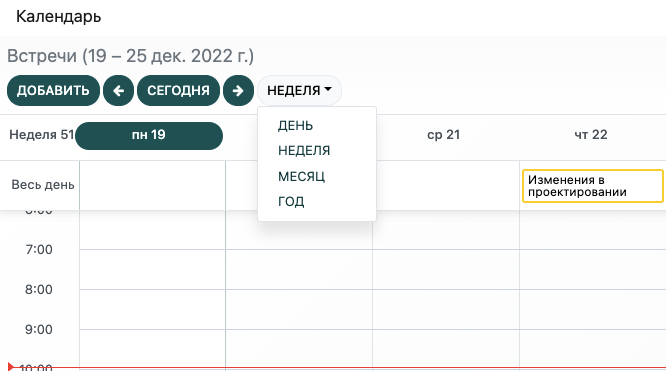
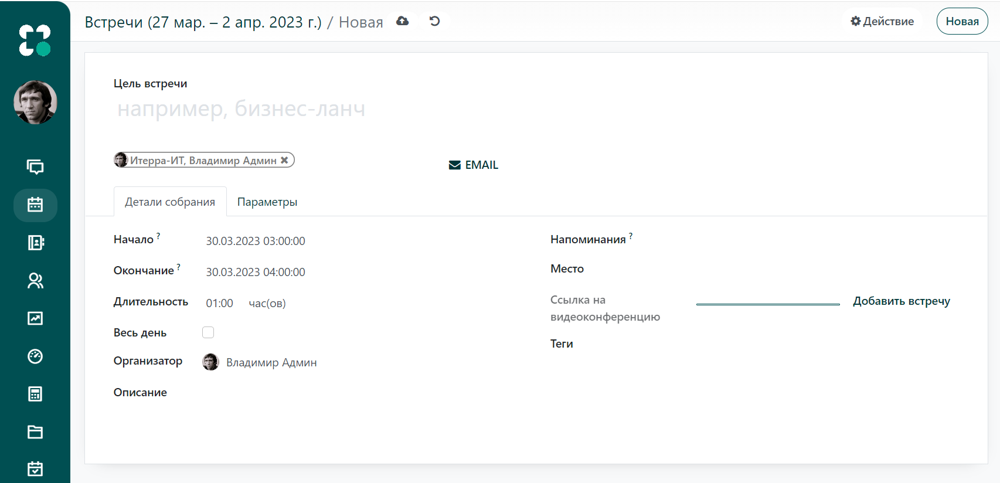
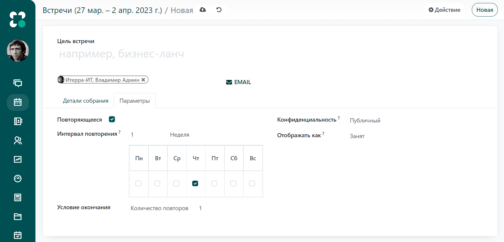

:show-content:

===================
Управление временем
===================

Когда вы планируете свои задачи и деятельность организации, вы минимизируете риск неэффективного управления рабочим процессом,
поскольку имеете четкие указания
на ход дальнейших действий. Планирование исключает бесполезную активность и
вероятность дублирования действий между членами команды. Удобный интерфейс системы **Модули** позволяет более эффективно планировать время,
тем самым повышая производительность.

Находясь в любом месте системы, вы можете легко использовать функцию планирования (значок *Действия*),
чтобы назначить встречу, звонок, выполнить рабочую операцию или совершить какую-либо другую активность.
Эта функция доступна в  меню *Действия* на рабочем столе, чаттере и на любой рабочей доске, а также
непосредственно в модуле *Календарь*.
Остановимся подробнее на каждом из доступных способов планирования.

Меню Действия
=============

Управление вашей активностью всегда доступно в меню *Действия* на рабочем столе. Меню отображает список задач, сгруппированных
по модулям,
включая просроченные действия и запланированные действия в настоящем и будущем. Выбрав любое действие из списка меню,
эта задача откроется в новом окне с возможностью редактирования или определения дальнейших действий.

Планирование действий
=====================

Вы можете планировать и управлять своей активностью,
выбрав значок *Действия* на рабочей доске в любом модуле системы.

Эта функция также доступна в любом чаттере.

Как запланировать действие
--------------------------
После нажатия на значок *Действия*, откроется окно *Запланировать действие*. Чтобы определить ход действий, установите необходимые параметры,
указав *Тип действия* и *Срок исполнения*. При необходимости, назначьте ответственного и добавьте комментарии.

         shown for Odoo Discuss

Вы можете определить следующие действия, нажав кнопку *СДЕЛАНО + ЗАПИСАТЬ ЕЩЕ*, и вам будут предложены следующие шаги.

Модуль Календарь
================

Воспользуйтесь модулем Календарь для планирования встреч с коллегами, партнерами или клиентами.
Чтобы создать встречу, нажмите кнопку *Добавить* или выберите нужный слот в календаре.

Примечание: Вы можете настроить календарный вид по дням, неделям, месяцам или годам, выбрав соответствующую опцию
из списка.

В окне *Встречи / Новое* укажите дату, время начала и окончания встречи.
Вы также можете добавить напоминание и онлайн ссылку на встречу.

Если необходимо, прикрепите документ к предстоящей встречи
и добавьте комментарий в поле *Описание*. Выберите участников из списка сотрудников компании или внешних пользователей
из ваших контактов. Нажмите кнопку *EMAIL* для отправки электронного письма всем участникам.

Если встреча проходит на постоянной основе, во вкладке *Параметры*, поставьте галочку в поле *Повторяющееся*, укажите
интервал повторения и условие окончания запланированных встреч.

После ввода всех необходимых данных, нажмите кнопку
*Создать* и это событие появиться в календаре.

Настройка типа действия
=======================

По умолчанию в Modooli доступно несколько типов действий (звонок, Email, встреча и т.д.). Однако,
вы можете установить новые, перейдя в меню: :menuselection:`Настройки --> Типы действий`.

.. tip::
   Если вам нужно создать тип действия, используя календарный план, убедитесь, что в поле *Действия* выбрана опция
   *Встреча*.

