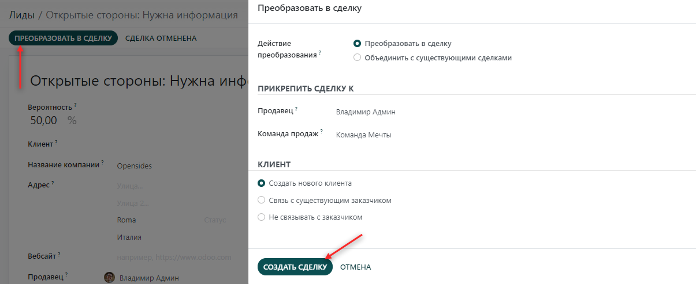

============================
Конвертация лидов в клиентов
============================

Система позволяет конвертировать лиды в тот момент, когда вы готовы работать с клиентом
в рамках сделки и назначить подходящих для сделки продавцов.

Вы можете активировать этот режим в настройках CRM. Он применяется ко всем каналам продаж
по умолчанию. Также, возможна специфическая настройка для определенных каналов.

Настройки
=========

Чтобы эта функция работала, перейдите в меню: :menuselection:`CRM --> Настройки --> Настройки`
и активируйте опцию **Лиды**. Нажмите **Сохранить**.

После этого появится новое меню *Лиды*.

Конвертируйте лида в сделку
===========================

Выберите лид из списка. На странице *Лиды*, вы можете преобразовать лид в
сделку, определить команду продаж/продавца и создать нового клиента.

Если в базе данных уже есть сделка с этим клиентом, система
автоматически предложит объединить сделки. Также программа автоматически предложит привязать
сделку к существующему клиенту, если такой клиент есть в базе данных.

Объедините сделки
=================

Вы также можете объединять сделки, если они имеют
одинаковый почтовый адрес. При этом система переносит
информацию в ту сделку, которая была создана первой, отдавая
приоритет информации в первой сделки.

Вся информация сохраняется: данные из другой сделки публикуются в
чаттере и информационных полях для быстрого доступа.

Если вы обнаружите дубликат, вы также можете объединить сделки
или лидов, даже если система этого не предлагает.

Для этого в списке лидов выберите сделки или лиды, которые вы
хотите объединить. Из появившегося списка действий выберите *Объединить*.

.. note::
   Система позволяет объединять более 2 сделок или лидов.