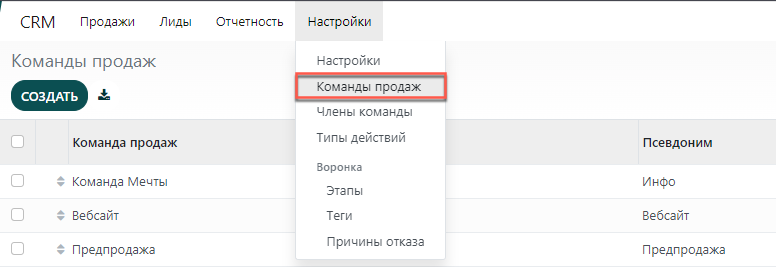

================================
Генерируйте лиды/сделки из писем
================================

Автоматизация лидогенерации несомненно повысит эффективность продаж.
Модуль **CRM** использует два способа конвертации: псевдоним электронной почты и
контактные формы на сайте.
По умолчанию, система будет создавать сделку в команде продаж каждый раз, когда кто-то отправляет письмо по адресу
псевдонима электронной почты или заполняет контактную форму на вашем сайте.

Настройка псевдонимов электронной почты
=======================================

Каждая команда продаж может иметь свой собственный псевдоним электронной почты
для автоматической генерации лидов/сделок.
Любое письмо, отправленное по адресу псевдонима электронной почты, автоматически
создаст сделку (если
функция лидов активирована в настройках модуля **CRM**).
Настройки команды продаж можно найти в меню:

:menuselection:`Настройки --> Команды продаж`.

Использование формы контакта на сайте
=====================================

По умолчанию на странице **Контакты** вашего сайта отображается готовая к использованию
форма контакта. Каждый раз, когда кто-то заполняет эту форму, в вашей базе данных
создается лид или сделка.

Для получения более подробной информации о лидогенерации с помощью вебсайта,
ознакомьтесь с темой :doc:`generate_from_website`.