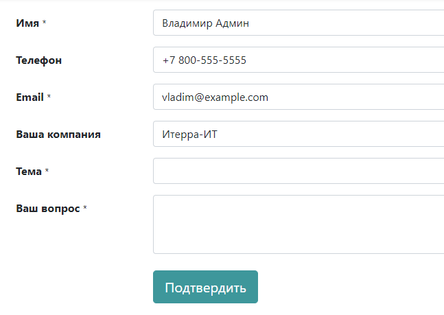

=============================================================
Генерируйте лиды/сделки со страницы вашего сайта с контактами
=============================================================

Автоматизация генерации потенциальных лидов/сделок значительно повысит
вашу эффективность. Любой посетитель, воспользовавшийся контактной формой на вашем сайте, создаст
лид/потенциальную сделку в воронке продаж.

Используйте контактную форму на вашем сайте
===========================================

Зайдите в приложение вашего сайта.

|image0|\ |image1|

Установив приложение CRM, вы получаете преимущество в виде готовой к использованию контактной формы
на вашем сайте, которая будет генерировать лиды/сделки
автоматически.

Чтобы переключиться на определенную команду продаж, перейдите в меню: :menuselection:`Вебсайт
--> Настройки --> Настройки`. В разделе *Общение* вы найдете
*Контактную форму*, где можно изменить *Команду продаж* или
*Продавца*.

Создание пользовательской формы контакта
========================================

Для создания контакта в модуле **Вебсайт** вам может понадобиться узнать больше информации о пользователе с вашего сайта.
Форма контакта может быть подобрана в зависимости от информации, которую необходимо получить
вашей команде - электронные письма, потенциальные лиды/сделки, проектные задачи, вопросы к службе поддержки и т.д.

Бесплатный модуль *Form Builder*, устанавливается автоматически при добавлении элемента Форма
через конструктор сайта. Он также может быть установлен вручную в модуле **Приложения**.

.. tip::
   Формы могут быть созданы c нуля для самых разных целей. Однако форма контакта по умолчанию
   разработана для удовлетворения потребностей большинства пользователей.

Изменение формы контакта
------------------------

В режиме редактирования сайта нажмите на любое поле. Поля в форме контакта станут
доступны для
редактирования.

По умолчанию любая новая контактная форма будет отправлять письмо по электронной почте. Но вы можете
переключиться на генерацию лидов/сделок, выбрав *Изменить параметры формы*.

Конвертация лида в сделку
=========================

При использовании контактной формы следует пройти этап отбора -
назначение формы нужным сотрудникам отдела продаж. Для этого активируйте *Лиды*
в настройках CRM. Для получения более подробной информации, обратитесь к теме :doc:`convert`.

.. |image0| image:: ./media/generate_from_website01.png
   :width: 1.04401in
   :height: 1.16146in
.. |image1| image:: ./media/generate_from_website02.png
   :width: 1.43229in
   :height: 1.16244in
