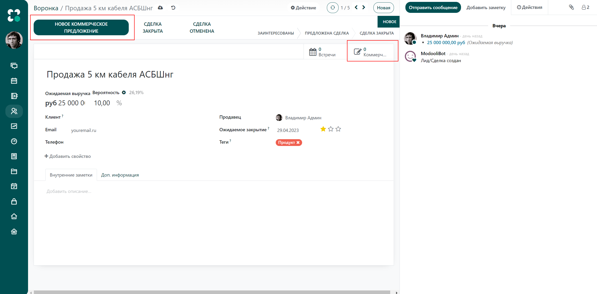

=================================
Отправка коммерческих предложений
=================================

Когда вы преобразуете лиды в сделку, скорее всего, потребуется
отправка коммерческого предложения.
Вы можете сделать это непосредственно в приложении *Учет покупателей*.

Создание нового коммерческого предложения
=========================================

В форме лида или сделки нажмите на кнопку *Новое коммерческое предложение*.
Откроется новое окно, где вы сможете настроить ваше предложение.

Все предложения для этой сделки находятся в меню
*Коммерческие предложения* на странице формы.

.. image:: media/send_quotes03.png
    :align: center

Сделка закрыта/проиграна
========================

Теперь необходимо преобразовать коммерческое предложение в сделку или указать
*Проиграно*, чтобы продвинуть процесс.

Если вы нажмете *Сделка закрыта*, предложение переместится в колонку *Сделка закрыта*
на канбан-доске. Если же вы пометите его как *Проиграно*, оно будет помещено в архив.
