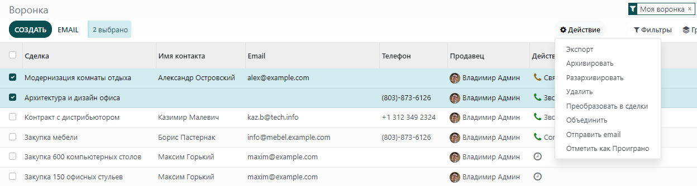

============================
Аналитика проигранных сделок
============================

Работая со сделками, вы можете проиграть некоторые из них. Модуль **CRM** позволяет
распознать причины проигрыша сделок и эффективно устранить их, а также, при необходимости,
восстановить их в системе.

Отметьте сделку как проигранную
===============================

В приложении **CRM** перейдите в меню: **Продажи --> Моя воронка** и выберите любую сделку. В форме сделки нажмите
кнопку *СДЕЛКА ОТМЕНЕНА*.

В новом окне выберите из списка *Причину отказа* или укажите свою причину.

Создание и редактирование причины отказа
----------------------------------------

*Причины отказа* находятся в меню: :menuselection:`Настройки --> Причины отказа`.

Вы можете выбрать и переименовать любую из них или создать новую причину.

Поиск проигранных сделок
========================

Чтобы открыть проигранные сделки и выполнить определенные действия с ними (отправить письмо,
сделать звонок для обратной связи и т.д.), на странице **Воронка**, выберите фильтр *Сделка отменена* в строке поиска.
Результаты поиска отобразят все проигранные сделки.

Вы также можете уточнить результаты поиска, используя фильтр *Причина отказа*,
например, указав: *Слишком дорого*.

Восстановление проигранных сделок
=================================

Используя быстрые фильтры на Канбан-доске, вы можете выбрать любую сделку и работать с ней
в обычном режиме. Вы также можете восстановить сделку, нажав на фильтр *Архивировано*.

Чтобы выбрать несколько сделок, отобразите их в виде списка.

.. image:: media/lost_opportunities06.png
   :align: center

Теперь вы можете выбрать из списка только определенные сделки или все сделки сразу и произвести
любые действия с ними.

