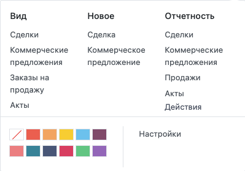

===========================
Управление командами продаж
===========================

В Odoo, вы можете управлять несколькими командами продаж, отделами или каналами, каждые из которых
будут иметь определенный процесс продаж.
Для этого мы используем понятие *Команды продаж*.

Создание новой команды продаж
=============================

Чтобы создать новую *Команду продаж*, перейдите в меню: :menuselection:`Настройки --> Команды продаж`.

На странице *Команды продаж* установите псевдоним электронной почты. Каждое сообщение,
отправленное на этот электронный адрес автоматически создаст лид или сделку.

Добавление участников в команду продаж
--------------------------------------

Вы можете добавить участников в любую команду; таким образом, они будут видеть
структуру воронки продаж этой команды, открывая ее. Любой
назначенный потенциальный клиент/сделка будет связан с каналом продаж.
Тем не менее, вы можете быть членом только одной команды.

Если отфильтровать эту команду продаж, перейдя в меню: **Продажи --> Моя воронка**, отобразятся все сделки команды.

Использование прогноза
======================

Функция, доступная в меню: **Отчетность --> Прогноз**, позволяет отобразить действия и результаты
любой команды продаж.

Прогноз доступен во всей экосистеме, поэтому каждое направление, которое служит источником
дохода в компании (Продажи, eCommerce, POS
и т.д.), может воспользоваться этой функцией.
