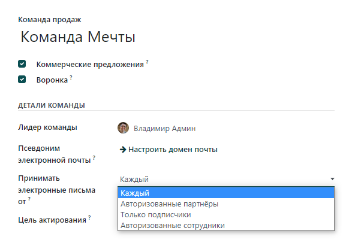
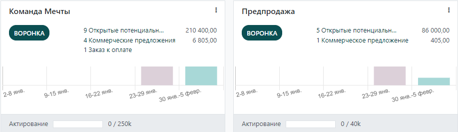

===========================
Управление командами продаж
===========================

В модуле **CRM**, вы можете управлять несколькими командами продаж, отделами или каналами, каждые из которых
будут иметь свою уникальную стратегию продаж.
Для этого мы используем понятие *Команды продаж*.

Создание новой команды продаж
=============================

Чтобы создать новую *Команду продаж*, перейдите в меню: :menuselection:`Настройки --> Команды продаж`.

На странице *Команды продаж* установите псевдоним электронной почты. Каждое сообщение,
отправленное на этот электронный адрес автоматически создаст лид или сделку. В поле
**Принимать электронные письма от** установите кто может получать электронные письма, выбрав из
списка необходимую опцию.

Добавление участников в команду продаж
--------------------------------------

Вы можете добавить участников в любую команду; таким образом, они будут видеть
структуру воронки продаж этой команды, открывая ее. Любой
назначенный потенциальный клиент/сделка будет связан с каналом продаж.

Чтобы добавить участников в команду продаж, откройте форму команды продаж и, на вкладке **Участники**,
нажмите **ДОБАВИТЬ**. Выберите сотрудника из списка или создайте нового пользователя.

Один человек может быть добавлен в качестве участника или лидера в несколько команд, что позволит ему
получить доступ ко всем необходимым воронкам продаж.

Обзор команд продаж
===================

Чтобы отобразить команды продаж в виде дашборда, перейдите в меню: **Продажи --> Команды**.
На странице появятся все команды, в которых вы являетесь участником.
По каждой команде представлен обзор открытых сделок, коммерческих предложений, заказов на продажу
и ожидаемого
дохода отдела продаж. Удобный график позволяет увидеть
количество новых сделок в неделю. Также доступна для анализа строка прогресса выставления
счетов **Актирование**.

Нажмите на три точки в углу плитки, чтобы открыть меню для быстрого просмотра документов
и отчетов, создания новых коммерческих предложений/сделок, выбора цвета команды или
для перехода на страницу настройки команды продаж.

