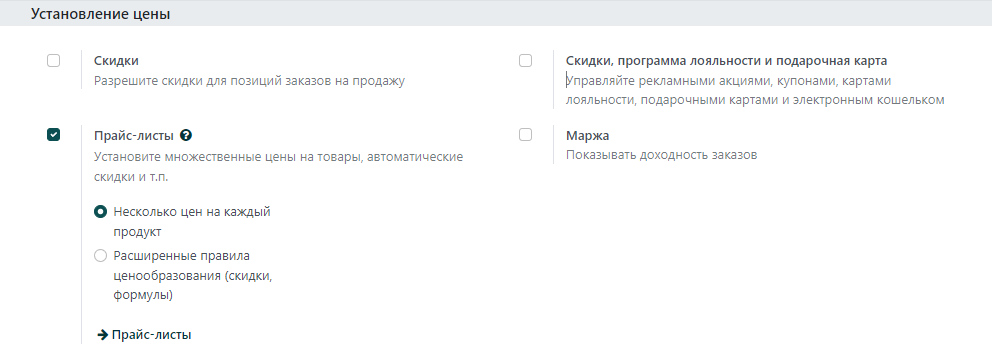

===================================================
Как адаптировать цены к клиентам и применять скидки
===================================================

Система **Модули** имеет мощную функцию прейскуранта для поддержки стратегии ценообразования, адаптированной
к вашему бизнесу.
Прайс-лист - это список цен или ценовых правил, которые система ищет для определения
предлагаемой цены.
Вы можете установить несколько критериев для использования определенной цены:
периоды, мин. проданное количество
(снижение цены происходит в соответствии с минимальным количеством заказа) и т.д.

Поскольку прайс-листы предлагают только цены, они могут быть скорректированы сотрудниками,
которые отвечают за заказы клиентов.
Выберите свою стратегию ценообразования в меню: :menuselection:`Продажи --> Настройки`,
раздел **Установление цены**.

.. note::

    * *Разные цены для продукта :* несколько цен устанавливаются на каждый продукт;
    * *Расширенные правила ценообразования :* позволяет применять скидки, наценки и округления.

Несколько цен за продукт
========================

Чтобы применить несколько цен на продукт, выберите *Разные цены для продукта*
в меню: :menuselection:`Продажи --> Настройки`.

Создание прайс-листов
---------------------

Создайте прайс-листы для разных сегментов: например, зарегистрированные, премиальные и т.д.

К любому новому клиенту применяется прайс-лист по умолчанию. Чтобы
сегментировать своих клиентов, откройте форму клиента и измените значение поля *Прайс* на вкладке
*Продажи и Закупки*.

Временные цены
---------------

Используйте специальные предложения для банковских праздников и т.д. Откройте прайс-лист
и введите даты начала и окончания.

.. tip::
   Убедитесь, что в прайсе установлены цены по умолчанию за пределами периода действия специального
   предложения. В противном случае у вас могут возникнуть проблемы после окончания этого периода.

Цены за минимальное количество
------------------------------

Откройте прайс-лист и в соответствующих столбцах укажите минимальное количество
и цены.

.. note::
    Порядок цен не имеет значения. Система является интеллектуальной и применяет
    первые цены, которые соответствуют дате заказа и/или минимальным количествам.

Скидки, наценки, округления
===========================

Опция **Расширенные правила ценообразования** позволяет устанавливать правила изменения цены.
Изменения могут относиться к цене на список продуктов/каталогов, себестоимости продукта
или к другому прайс-листу. Изменения рассчитываются с помощью скидок или надбавки и могут
принудительно вписываться в нижний (минимальная наценка) и верхний (максимальная наценка) пределы.
Цены могут быть округлены до ближайшего цента/доллара или кратного числа
(ближайшие 5 центов, ближайшие 10 долларов).

После установки перейдите в меню:
:menuselection:`Продажи --> Настройки --> Прайс-листы`
(или меню: :menuselection:`Website Admin --> Catalog --> Pricelists`, если вы используете
модуль e-Commerce).

Каждый элемент прайс-листа может быть связан либо со всеми продуктами,
либо с внутренней категорией продукта (набором продуктов), либо с конкретным продуктом.
Как и во втором варианте, вы можете установить даты и минимальные количества.

.. note::

    * И снова система умна. Если для определенного элемента установлено правило,
      а другое для его категории, система примет правило элемента.

    * Убедитесь, что хотя бы один элемент прайс-листа распространяется на все ваши продукты.
  
Существует 3 способа вычисления: фиксировать цену, скидку и формулу.

Здесь возможны различные ценовые настройки благодаря формулам.

Скидки с округлением
--------------------

Например, скидки 20% с ценами, округленными до 9,99.

Затраты с надбавками (розничная торговля)
-----------------------------------------

Например, цена продажи = 2*стоимость (100% наценка) с минимальной маржой в $5.

Цены по странам
===============
Прайс-листы могут быть установлены по группам стран.
Любой новый клиент, зарегистрированный в системе, получает прайс-лист по умолчанию,
т.е. первый в списке, соответствующем стране.
Если для клиента не задана страна, система использует первый прейскурант без группы стран.

Прайс-лист по умолчанию можно заменить при создании заказа на продажу.

.. tip:: Вы можете изменить последовательность прайс-листов, перетащив их в виде списка.

Вычисление скидки% для клиентов
===============================

В случае скидки вы можете показать клиентам общедоступную цену и вычисленную
скидку % в распечатанных заказах на продажу и в каталоге электронной коммерции. Для этого:
* Отметьте галочкой *Разрешить скидки по строкам заказа клиента* в меню: :menuselection:`Продажи -->
Настройки --> Настройки --> Коммерческие предложения и заказы на продажу --> Скидки`.
* Примените эту опцию в форме настройки прайс-листа.

.. seealso::

    * :doc:`currencies`
